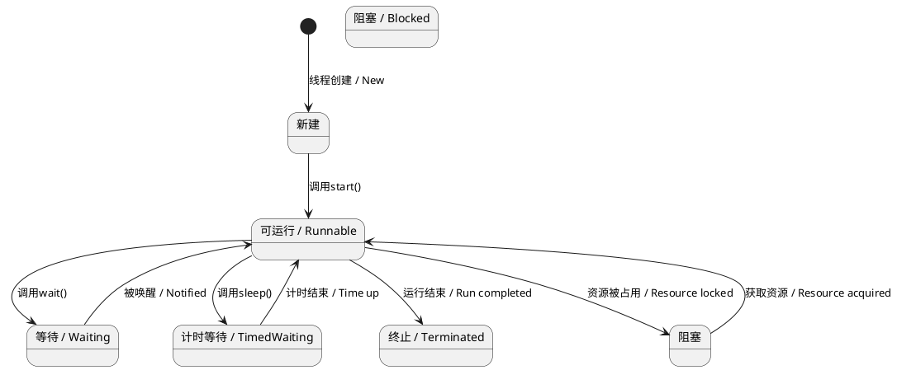

---
tags:
  - Language
  - Java
  - Thread
---

# Java 线程

在 Java 中，线程是一种轻量级的多任务机制。Java 通过 `java.lang.Thread` 类和 `java.util.concurrent` 包中的高级 API 提供了对多线程编程的支持。下面详细介绍 Java 中线程的使用方法和相关概念。

> [!summary]
>
> Java 提供了多种机制来创建和管理线程，从 `Thread` 类和 `Runnable` 接口到高级的 `Executor` 线程池和并发工具。通过适当的同步和线程管理，可以确保线程安全和高效的多线程应用程序。

## 1 创建线程

> [!summary] Java 中创建线程的三种方式
>
> - **继承 `Thread` 类**：适用于简单情况，但继承会限制类的其他功能（因为 Java 不支持多继承）。
> - **实现 `Runnable` 接口**：推荐使用，灵活性更高，适合不需要返回结果的任务。
> - **实现 `Callable` 接口**：适合需要返回结果或者可能抛出异常的任务，结合 `Future` 获取结果。

### 1.1 继承 `Thread` 类

当一个类继承 `Thread` 类时，需要重写其 `run()` 方法，这个方法包含了该线程执行的任务。

```java
class MyThread extends Thread {
    public void run() {
        // 线程要执行的任务
        System.out.println("Thread is running");
    }
}

public class ThreadExample {
    public static void main(String[] args) {
        MyThread t1 = new MyThread();
        t1.start();  // 启动线程，调用 run() 方法
    }
}
```

**注意：** `start()` 方法用于启动线程，实际上调用的是 `run()` 方法。不要直接调用 `run()` 方法，否则它只会作为普通方法执行，不会创建新线程。

### 1.2 实现 `Runnable` 接口

相比继承 `Thread`，实现 `Runnable` 接口更加灵活，因为 Java 是单继承机制，无法同时继承多个类。通过实现 `Runnable` 接口，可以使类同时具备多线程能力和继承其他类的能力。

```java
class MyRunnable implements Runnable {
    public void run() {
        // 线程要执行的任务
        System.out.println("Runnable is running");
    }
}

public class RunnableExample {
    public static void main(String[] args) {
        Thread t1 = new Thread(new MyRunnable());
        t1.start();  // 启动线程，执行 run() 方法
    }
}
```

### 1.3 实现 `Callable` 接口

与 `Runnable` 不同的是，`Callable` 的 `call()` 方法可以返回结果并且可以抛出异常。通常结合 `Future` 接口用于获取线程执行结果或检查线程是否完成。

```java
import java.util.concurrent.Callable;
import java.util.concurrent.ExecutionException;
import java.util.concurrent.ExecutorService;
import java.util.concurrent.Executors;
import java.util.concurrent.Future;

public class CallableExample {
    public static void main(String[] args) throws InterruptedException, ExecutionException {
        // 创建一个单线程的线程池
        ExecutorService executor = Executors.newSingleThreadExecutor();

        // 创建 Callable 对象
        Callable<Integer> task = () -> {
            // 线程执行的任务，返回结果
            return 123;
        };

        // 提交任务并获取 Future 对象
        Future<Integer> future = executor.submit(task);

        // 获取 Callable 执行的返回结果
        Integer result = future.get();
        System.out.println("Result: " + result);

        // 关闭线程池
        executor.shutdown();
    }
}
```

**关键点：**

- `Callable` 的 `call()` 方法类似于 `Runnable` 的 `run()` 方法，但它允许返回一个值。
- `Future` 是用来保存 `Callable` 的执行结果，调用 `get()` 方法可以获取结果（线程执行完毕后返回）。
- `Callable` 可以抛出受检异常，而 `Runnable` 不允许抛出。

## 2 线程的生命周期

Java 线程有五个主要状态：

- **新建（New）**：线程对象创建后，但未调用 `start()` 方法。
- **就绪（Runnable）**：调用了 `start()` 方法，线程准备好被调度执行。
- **运行（Running）**：线程调度器从就绪线程池中选中某线程，开始执行 `run()` 方法。
- **阻塞（Blocked）**：线程由于等待资源（如锁）而暂时暂停执行。
- **终止（Terminated）**：线程执行完毕或异常终止。



## 3 线程的控制方法

- `sleep(long millis)`：使当前线程休眠指定的毫秒数。

  ```java
  try {
      Thread.sleep(1000);  // 线程休眠1秒
  } catch (InterruptedException e) {
      e.printStackTrace();
  }
  ```

- `join()`：等待该线程执行结束后再继续执行。

  ```java
  Thread t1 = new Thread(() -> System.out.println("Thread 1"));
  t1.start();
  try {
      t1.join();  // 等待 t1 线程执行结束
  } catch (InterruptedException e) {
      e.printStackTrace();
  }
  System.out.println("Main thread");
  ```

- `yield()`：让出当前 CPU 执行权，重新进入就绪状态，让其他线程有机会执行。

  ```java
  Thread.yield();
  ```

- `interrupt()`：中断线程，但不会立即终止线程，线程需要自己处理中断信号。

  ```java
  Thread t1 = new Thread(() -> {
      while (!Thread.currentThread().isInterrupted()) {
          System.out.println("Thread is running");
      }
  });
  t1.start();
  t1.interrupt();  // 发送中断信号
  ```

## 4 线程同步

当多个线程访问共享资源时，可能会产生线程安全问题。为解决这个问题，Java 提供了同步机制。

### 4.1 同步代码块

使用 `synchronized` 关键字可以将代码块或方法设为同步，确保同一时间只有一个线程可以执行该代码块或方法。

```java
class Counter {
    private int count = 0;

    public synchronized void increment() {
        count++;
    }

    public int getCount() {
        return count;
    }
}

public class SyncExample {
    public static void main(String[] args) throws InterruptedException {
        Counter counter = new Counter();

        Thread t1 = new Thread(() -> {
            for (int i = 0; i < 1000; i++) {
                counter.increment();
            }
        });

        Thread t2 = new Thread(() -> {
            for (int i = 0; i < 1000; i++) {
                counter.increment();
            }
        });

        t1.start();
        t2.start();

        t1.join();
        t2.join();

        System.out.println("Count: " + counter.getCount());
    }
}
```

### 4.2 同步方法

可以直接使用 `synchronized` 关键字修饰整个方法，使该方法在任意时刻只能被一个线程执行。

```java
public synchronized void increment() {
    count++;
}
```

### 4.3 `volatile` 关键字

`volatile` 用于修饰变量，保证变量的可见性和有序性。被 `volatile` 修饰的变量，每次读写都直接从主内存中读取，而不是从线程的工作内存中读取。

```java
class VolatileExample {
    private volatile boolean running = true;

    public void stopRunning() {
        running = false;
    }

    public void run() {
        while (running) {
            System.out.println("Thread is running");
        }
    }
}
```

## 5 使用线程池

手动创建和管理线程较为繁琐，Java 提供了 `ExecutorService` 来简化线程的管理。`Executors` 类提供了多种创建线程池的方法。

```java
import java.util.concurrent.ExecutorService;
import java.util.concurrent.Executors;

public class ThreadPoolExample {
    public static void main(String[] args) {
        // 创建固定大小的线程池
        ExecutorService executor = Executors.newFixedThreadPool(3);

        for (int i = 0; i < 5; i++) {
            executor.execute(() -> {
                System.out.println(Thread.currentThread().getName() + " is running");
            });
        }

        // 关闭线程池
        executor.shutdown();
    }
}
```

### 5.1 高级并发工具

Java 提供了 `java.util.concurrent` 包中的一系列工具类，用于处理多线程中的复杂场景。`concurrent` 包中的工具类能够帮助我们控制线程的执行顺序、管理共享资源的访问，甚至提供更高层次的并发控制。这些工具类对于构建高效、健壮的多线程程序非常重要。

#### 5.1.1 常用工具类一览

| 工具类            | 功能描述                                                       |
|-------------------|----------------------------------------------------------------|
| `CountDownLatch`   | 允许一个或多个线程等待其他线程完成操作。                       |
| `CyclicBarrier`    | 允许一组线程相互等待，直到所有线程到达屏障点再继续执行。        |
| `Semaphore`        | 控制同时访问某个资源的线程数量。                               |
| `ReentrantLock`    | 提供了比 `synchronized` 更加灵活的锁机制。                     |
| `Future`           | 获取线程任务的执行结果。                                       |
| `ExecutorService`  | 提供了线程池的管理机制，简化线程的创建与执行。                 |
| `BlockingQueue`    | 支持线程安全的队列操作，常用于生产者-消费者模式。               |
| `Exchanger`        | 两个线程可以在指定的同步点交换数据。                           |
| `Phaser`           | 用于多阶段任务的线程同步。                                     |

## 6 `Semaphore` (信号量)

`Semaphore` 是一种用于控制访问共享资源的线程同步工具。它可以限制同时访问某一资源的线程数量，通过计数器控制线程的并发数。当一个线程试图访问受限资源时，必须获取信号量，如果信号量的计数器大于 0，则线程可以继续执行，并使计数器减 1；否则，线程进入等待状态，直到其他线程释放信号量（计数器加 1）。

### 6.1 示例

以下是一个简单的例子，演示如何使用 `Semaphore` 控制多个线程对某一资源的并发访问。

```java
import java.util.concurrent.Semaphore;

class SharedResource {
    private Semaphore semaphore = new Semaphore(3); // 同时允许 3 个线程访问

    public void accessResource() {
        try {
            // 获取信号量，若计数器为 0 则阻塞等待
            semaphore.acquire();
            System.out.println(Thread.currentThread().getName() + " is accessing resource");
            Thread.sleep(2000); // 模拟资源访问耗时
        } catch (InterruptedException e) {
            e.printStackTrace();
        } finally {
            // 释放信号量
            System.out.println(Thread.currentThread().getName() + " is releasing resource");
            semaphore.release();
        }
    }
}

public class SemaphoreExample {
    public static void main(String[] args) {
        SharedResource resource = new SharedResource();

        // 启动多个线程同时访问资源
        for (int i = 0; i < 10; i++) {
            Thread t = new Thread(resource::accessResource);
            t.start();
        }
    }
}
```

### 6.2 工作原理

- **acquire()**：当线程调用 `acquire()` 时，它会尝试获取信号量。如果信号量的计数器大于 0，线程继续执行，计数器减 1。如果计数器为 0，线程将被阻塞，直到有其他线程释放信号量。
  
- **release()**：当线程完成对资源的访问后，调用 `release()` 方法释放信号量，计数器加 1，唤醒等待中的线程。

### 6.3 使用场景

- **数据库连接池**：限制同时访问数据库的连接数。
- **限流**：在高并发情况下控制服务请求的数量，防止系统超负荷运行。
- **资源共享**：控制对有限资源的并发访问，如打印机、文件系统等。
