---
tags:
  - RabbitMQ
  - Kafka
  - RocketMQ
---

# MQ

## 1 初识 MQ

### 1.1 同步调用

- 拓展性差
- 性能下降
- 级联失败

### 1.2 异步调用

异步调用通过消息通知机制解耦调用方和服务提供方，提高性能和可扩展性。

**核心角色：**

- **消息发送者：** 原调用方，负责投递消息。
- **消息 Broker：** 管理、暂存、转发消息的中间件（如消息队列）。
- **消息接收者：** 原服务提供方，订阅并处理消息。

**PlantUML 图例：**


**异步调用优势：**

- **低耦合：** 服务间依赖减少，变更影响小。
- **高性能：** 并行处理，缩短响应时间。
- **可扩展：** 灵活添加订阅者，无需修改核心服务。
- **故障隔离：** 服务间故障不相互影响。

**异步调用缺点：**

- **依赖 Broker：** 系统可靠性受 Broker 影响。
- **架构复杂：** 调试、维护难度增加。

### 1.3 技术选型

消息 Broker，目前常见的实现方案就是消息队列（MessageQueue），简称为 MQ

|       | **RabbitMQ**         | **ActiveMQ**                     | **RocketMQ** | **Kafka**  |
| ----- | -------------------- | -------------------------------- | ------------ | ---------- |
| 公司/社区 | Rabbit               | Apache                           | 阿里           | Apache     |
| 开发语言  | Erlang               | Java                             | Java         | Scala&Java |
| 协议支持  | AMQP，XMPP，SMTP，STOMP | OpenWire, STOMP，REST, XMPP, AMQP | 自定义协议        | 自定义协议      |
| 可用性   | 高                    | 一般                               | 高            | 高          |
| 单机吞吐量 | 一般                   | 差                                | 高            | 非常高        |
| 消息延迟  | 微秒级                  | 毫秒级                              | 毫秒级          | 毫秒以内       |
| 消息可靠性 | 高                    | 一般                               | 高            | 一般         |

追求可用性：Kafka、 RocketMQ 、RabbitMQ  
追求可靠性：RabbitMQ、RocketMQ  
追求吞吐能力：RocketMQ、Kafka  
追求消息低延迟：RabbitMQ、Kafka

> [!info] RabbitMQ  
> [RabbitMQ](https://www.rabbitmq.com/)  
> [RabbitMQ Server Repo](https://github.com/rabbitmq/rabbitmq-server)  

> [!info] RocketMQ  
> [RocketMQ](https://rocketmq.apache.org/)  
> [RocketMQ Repo](https://github.com/apache/rocketmq)  
> [RocketMQ Doc](https://github.com/alibaba/spring-cloud-alibaba/wiki/RocketMQ)  

## 2 RabbitMQ

#RabbitMQ

### 2.1 安装

```shell
docker run \
 -e RABBITMQ_DEFAULT_USER=root \
 -e RABBITMQ_DEFAULT_PASS=114514 \
 -v mq-plugins:/plugins \
 --name mq \
 --hostname mq \
 -p 15672:15672 \
 -p 5672:5672 \
 --network dev \
 -d \
 rabbitmq:3.13-management
```

- 15672：RabbitMQ 提供的管理控制台的端口
- 5672：RabbitMQ 的消息发送处理接口

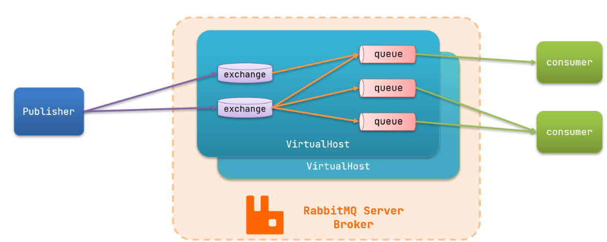

- `publisher`：生产者，也就是发送消息的一方
- `consumer`：消费者，也就是消费消息的一方
- `queue`：队列，存储消息。生产者投递的消息会暂存在消息队列中，等待消费者处理
- `exchange`：交换机，负责消息路由。生产者发送的消息由交换机决定投递到哪个队列。
- `virtual host`：虚拟主机，起到数据隔离的作用。每个虚拟主机相互独立，有各自的 exchange、queue

### 2.2 收发消息

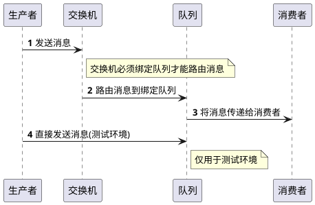

### 2.3 数据隔离

#### 2.3.1 用户管理

利用 `virtual host` 的隔离特性，将不同项目隔离。一般会做两件事情：

- 给每个项目创建独立的运维账号，将管理权限分离。
- 给每个项目创建不同的 `virtual host`，将每个项目的数据隔离。

## 3 SpringAMQP

由于 `RabbitMQ` 采用了 AMQP 协议，因此它具备跨语言的特性。任何语言只要遵循 AMQP 协议收发消息，都可以与 `RabbitMQ` 交互。并且 `RabbitMQ` 官方也提供了各种不同语言的客户端。通常搭配 Spring 进行使用，即 `Spring AMQP`

> [!note] [Spring AMQP](https://spring.io/projects/spring-amqp)
> - 自动声明队列、交换机及其绑定关系
> - 基于注解的监听器模式，异步接收消息
> - 封装了 RabbitTemplate 工具，用于发送消息

### 3.1 DEMO

```xml
<?xml version="1.0" encoding="UTF-8"?>  
<project xmlns:xsi="http://www.w3.org/2001/XMLSchema-instance"  
         xmlns="http://maven.apache.org/POM/4.0.0"  
         xsi:schemaLocation="http://maven.apache.org/POM/4.0.0 http://maven.apache.org/xsd/maven-4.0.0.xsd">  
    <modelVersion>4.0.0</modelVersion>  
  
    <groupId>org.example</groupId>  
    <artifactId>MQ_DEMO</artifactId>  
    <version>1.0-SNAPSHOT</version>  
    <modules>  
        <module>publisher</module>  
        <module>consumer</module>  
    </modules>  
    <packaging>pom</packaging>  
  
    <parent>  
        <groupId>org.springframework.boot</groupId>  
        <artifactId>spring-boot-starter-parent</artifactId>  
        <version>2.7.12</version>  
        <relativePath/>  
    </parent>  
  
    <properties>  
        <maven.compiler.source>8</maven.compiler.source>  
        <maven.compiler.target>8</maven.compiler.target>  
    </properties>  
  
    <dependencies>  
        <dependency>  
            <groupId>org.projectlombok</groupId>  
            <artifactId>lombok</artifactId>  
        </dependency>  
        <!--AMQP依赖，包含RabbitMQ-->  
        <dependency>  
            <groupId>org.springframework.boot</groupId>  
            <artifactId>spring-boot-starter-amqp</artifactId>  
        </dependency>  
        <!--单元测试-->  
        <dependency>  
            <groupId>org.springframework.boot</groupId>  
            <artifactId>spring-boot-starter-test</artifactId>  
        </dependency>  
    </dependencies>  
</project>
```

### 3.2 快速入门

可以直接向队列发送消息，跳过交换机 (仅用于测试)


新建队列 `simple.queue ` 用于测试

#### 3.2.1 消息发送

首先配置 MQ 地址，在 `publisher` 服务的 `application.yml` 中添加配置：

```yaml
logging:  
  pattern:  
    dateformat: MM-dd HH:mm:ss:SSS  
spring:  
  rabbitmq:  
    host: aliyun # 你的虚拟机IP  
    port: 5672 # 端口  
    virtual-host: /test # 虚拟主机  
    username: test # 用户名  
    password: test # 密码
```

然后在 `publisher` 服务中编写测试类 `SpringAmqpTest`，并利用 `RabbitTemplate` 实现消息发送：

```java
package org.example.publisher.amqp;

import org.junit.jupiter.api.Test;
import org.springframework.amqp.rabbit.core.RabbitTemplate;
import org.springframework.beans.factory.annotation.Autowired;
import org.springframework.boot.test.context.SpringBootTest;

@SpringBootTest
public class SpringAmqpTest {

    @Autowired
    private RabbitTemplate rabbitTemplate;

    @Test
    public void testSimpleQueue() {
        // 队列名称
        String queueName = "simple.queue";
        // 消息
        String message = "hello, spring amqp!";
        // 发送消息
        rabbitTemplate.convertAndSend(queueName, message);
    }
}
```

#### 3.2.2 消息接收

首先配置 MQ 地址，在 `consumer` 服务的 `application.yml` 中添加配置：

```yaml
logging:  
  pattern:  
    dateformat: MM-dd HH:mm:ss:SSS  
spring:  
  rabbitmq:  
    host: aliyun # 你的虚拟机IP  
    port: 5672 # 端口  
    virtual-host: /test # 虚拟主机  
    username: test # 用户名  
    password: test # 密码
```

然后在 `consumer` 服务的 `org.example.consumer.listener` 包中新建一个类 `SpringRabbitListener`，代码如下：

```java
package org.example.consumer.listener;

import org.springframework.amqp.rabbit.annotation.RabbitListener;
import org.springframework.stereotype.Component;

@Component
public class SpringRabbitListener {
	// 利用RabbitListener来声明要监听的队列信息
    // 将来一旦监听的队列中有了消息，就会推送给当前服务，调用当前方法，处理消息。
    // 可以看到方法体中接收的就是消息体的内容
    @RabbitListener(queues = "simple.queue")
    public void listenSimpleQueueMessage(String msg) throws InterruptedException {
        System.out.println("spring 消费者接收到消息：【" + msg + "】");
    }
}
```

### 3.3 WorkQueues 模型

Work Queues 是一种任务分发模型，通过多个消费者共同消费同一个队列中的消息，可以提高消息处理速度，特别适用于处理耗时任务的场景。  

- 多个消费者绑定到一个队列，同一条消息只会被一个消费者处理
- 通过设置 prefetch 来控制消费者预取的消息数量

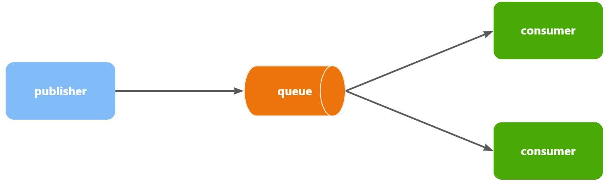

创建一个新的队列，命名为 `work.queue`

#### 3.3.1 消息发送

这次我们循环发送，模拟大量消息堆积现象。  
在 publisher 服务中的 SpringAmqpTest 类中添加一个测试方法：

```java
/**
     * workQueue
     * 向队列中不停发送消息，模拟消息堆积。
     */
@Test
public void testWorkQueue() throws InterruptedException {
    // 队列名称
    String queueName = "simple.queue";
    // 消息
    String message = "hello, message_";
    for (int i = 0; i < 50; i++) {
        // 发送消息，每20毫秒发送一次，相当于每秒发送50条消息
        rabbitTemplate.convertAndSend(queueName, message + i);
        Thread.sleep(20);
    }
}
```

#### 3.3.2 消息接收

要模拟多个消费者绑定同一个队列，我们在 consumer 服务的 SpringRabbitListener 中添加 2 个新的方法：

```java
@RabbitListener(queues = "work.queue")
public void listenWorkQueue1(String msg) throws InterruptedException {
    System.out.println("消费者1接收到消息：【" + msg + "】" + LocalTime.now());
    Thread.sleep(20);
}

@RabbitListener(queues = "work.queue")
public void listenWorkQueue2(String msg) throws InterruptedException {
    System.err.println("消费者2........接收到消息：【" + msg + "】" + LocalTime.now());
    Thread.sleep(200);
}
```

注意到这两消费者，都设置了 `Thead.sleep`，模拟任务耗时：

- 消费者 1 sleep 了 20 毫秒，相当于每秒钟处理 50 个消息
- 消费者 2 sleep 了 200 毫秒，相当于每秒处理 5 个消息

#### 3.3.3 测试

```java
消费者1接收到消息：【hello, message_0】21:06:00.869555300
消费者2........接收到消息：【hello, message_1】21:06:00.884518
消费者1接收到消息：【hello, message_2】21:06:00.907454400
消费者1接收到消息：【hello, message_4】21:06:00.953332100
消费者1接收到消息：【hello, message_6】21:06:00.997867300
消费者1接收到消息：【hello, message_8】21:06:01.042178700
消费者2........接收到消息：【hello, message_3】21:06:01.086478800
消费者1接收到消息：【hello, message_10】21:06:01.087476600
消费者1接收到消息：【hello, message_12】21:06:01.132578300
消费者1接收到消息：【hello, message_14】21:06:01.175851200
消费者1接收到消息：【hello, message_16】21:06:01.218533400
消费者1接收到消息：【hello, message_18】21:06:01.261322900
消费者2........接收到消息：【hello, message_5】21:06:01.287003700
消费者1接收到消息：【hello, message_20】21:06:01.304412400
消费者1接收到消息：【hello, message_22】21:06:01.349950100
消费者1接收到消息：【hello, message_24】21:06:01.394533900
消费者1接收到消息：【hello, message_26】21:06:01.439876500
消费者1接收到消息：【hello, message_28】21:06:01.482937800
消费者2........接收到消息：【hello, message_7】21:06:01.488977100
消费者1接收到消息：【hello, message_30】21:06:01.526409300
消费者1接收到消息：【hello, message_32】21:06:01.572148
消费者1接收到消息：【hello, message_34】21:06:01.618264800
消费者1接收到消息：【hello, message_36】21:06:01.660780600
消费者2........接收到消息：【hello, message_9】21:06:01.689189300
消费者1接收到消息：【hello, message_38】21:06:01.705261
消费者1接收到消息：【hello, message_40】21:06:01.746927300
消费者1接收到消息：【hello, message_42】21:06:01.789835
消费者1接收到消息：【hello, message_44】21:06:01.834393100
消费者1接收到消息：【hello, message_46】21:06:01.875312100
消费者2........接收到消息：【hello, message_11】21:06:01.889969500
消费者1接收到消息：【hello, message_48】21:06:01.920702500
消费者2........接收到消息：【hello, message_13】21:06:02.090725900
消费者2........接收到消息：【hello, message_15】21:06:02.293060600
消费者2........接收到消息：【hello, message_17】21:06:02.493748
消费者2........接收到消息：【hello, message_19】21:06:02.696635100
消费者2........接收到消息：【hello, message_21】21:06:02.896809700
消费者2........接收到消息：【hello, message_23】21:06:03.099533400
消费者2........接收到消息：【hello, message_25】21:06:03.301446400
消费者2........接收到消息：【hello, message_27】21:06:03.504999100
消费者2........接收到消息：【hello, message_29】21:06:03.705702500
消费者2........接收到消息：【hello, message_31】21:06:03.906601200
消费者2........接收到消息：【hello, message_33】21:06:04.108118500
消费者2........接收到消息：【hello, message_35】21:06:04.308945400
消费者2........接收到消息：【hello, message_37】21:06:04.511547700
消费者2........接收到消息：【hello, message_39】21:06:04.714038400
消费者2........接收到消息：【hello, message_41】21:06:04.916192700
消费者2........接收到消息：【hello, message_43】21:06:05.116286400
消费者2........接收到消息：【hello, message_45】21:06:05.318055100
消费者2........接收到消息：【hello, message_47】21:06:05.520656400
消费者2........接收到消息：【hello, message_49】21:06:05.723106700

```

可以看到消费者 1 和消费者 2 竟然每人消费了 25 条消息：

- 消费者 1 很快完成了自己的 25 条消息
- 消费者 2 却在缓慢的处理自己的 25 条消息。

也就是说消息是**平均分配**给每个消费者，并*没有考虑到消费者的处理能力*。导致 1 个消费者空闲，另一个消费者忙的不可开交。没有充分利用每一个消费者的能力，最终消息处理的耗时远远超过了 1 秒。这样显然是有问题的。

#### 3.3.4 能者多劳

在 spring 中有一个简单的配置，可以解决这个问题。我们修改 consumer 服务的 application. yml 文件，添加配置：

```yaml
spring:
  rabbitmq:
    listener:
      simple:
        prefetch: 1 # 每次只能获取一条消息，处理完成才能获取下一个消息
```

再次测试，发现结果如下：

```java
消费者1接收到消息：【hello, message_0】21:12:51.659664200
消费者2........接收到消息：【hello, message_1】21:12:51.680610
消费者1接收到消息：【hello, message_2】21:12:51.703625
消费者1接收到消息：【hello, message_3】21:12:51.724330100
消费者1接收到消息：【hello, message_4】21:12:51.746651100
消费者1接收到消息：【hello, message_5】21:12:51.768401400
消费者1接收到消息：【hello, message_6】21:12:51.790511400
消费者1接收到消息：【hello, message_7】21:12:51.812559800
消费者1接收到消息：【hello, message_8】21:12:51.834500600
消费者1接收到消息：【hello, message_9】21:12:51.857438800
消费者1接收到消息：【hello, message_10】21:12:51.880379600
消费者2........接收到消息：【hello, message_11】21:12:51.899327100
消费者1接收到消息：【hello, message_12】21:12:51.922828400
消费者1接收到消息：【hello, message_13】21:12:51.945617400
消费者1接收到消息：【hello, message_14】21:12:51.968942500
消费者1接收到消息：【hello, message_15】21:12:51.992215400
消费者1接收到消息：【hello, message_16】21:12:52.013325600
消费者1接收到消息：【hello, message_17】21:12:52.035687100
消费者1接收到消息：【hello, message_18】21:12:52.058188
消费者1接收到消息：【hello, message_19】21:12:52.081208400
消费者2........接收到消息：【hello, message_20】21:12:52.103406200
消费者1接收到消息：【hello, message_21】21:12:52.123827300
消费者1接收到消息：【hello, message_22】21:12:52.146165100
消费者1接收到消息：【hello, message_23】21:12:52.168828300
消费者1接收到消息：【hello, message_24】21:12:52.191769500
消费者1接收到消息：【hello, message_25】21:12:52.214839100
消费者1接收到消息：【hello, message_26】21:12:52.238998700
消费者1接收到消息：【hello, message_27】21:12:52.259772600
消费者1接收到消息：【hello, message_28】21:12:52.284131800
消费者2........接收到消息：【hello, message_29】21:12:52.306190600
消费者1接收到消息：【hello, message_30】21:12:52.325315800
消费者1接收到消息：【hello, message_31】21:12:52.347012500
消费者1接收到消息：【hello, message_32】21:12:52.368508600
消费者1接收到消息：【hello, message_33】21:12:52.391785100
消费者1接收到消息：【hello, message_34】21:12:52.416383800
消费者1接收到消息：【hello, message_35】21:12:52.439019
消费者1接收到消息：【hello, message_36】21:12:52.461733900
消费者1接收到消息：【hello, message_37】21:12:52.485990
消费者1接收到消息：【hello, message_38】21:12:52.509219900
消费者2........接收到消息：【hello, message_39】21:12:52.523683400
消费者1接收到消息：【hello, message_40】21:12:52.547412100
消费者1接收到消息：【hello, message_41】21:12:52.571191800
消费者1接收到消息：【hello, message_42】21:12:52.593024600
消费者1接收到消息：【hello, message_43】21:12:52.616731800
消费者1接收到消息：【hello, message_44】21:12:52.640317
消费者1接收到消息：【hello, message_45】21:12:52.663111100
消费者1接收到消息：【hello, message_46】21:12:52.686727
消费者1接收到消息：【hello, message_47】21:12:52.709266500
消费者2........接收到消息：【hello, message_48】21:12:52.725884900
消费者1接收到消息：【hello, message_49】21:12:52.746299900

```

### 3.4 交换机类型

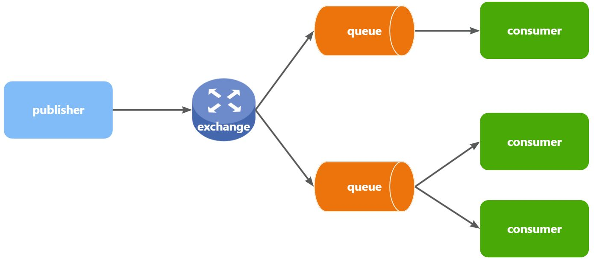

- **Publisher**：生产者，不再发送消息到队列中，而是发给交换机
- **Exchange**：交换机，一方面，接收生产者发送的消息。另一方面，知道如何处理消息，例如递交给某个特别队列、递交给所有队列、或是将消息丢弃。到底如何操作，取决于 Exchange 的类型。
- **Queue**：消息队列也与以前一样，接收消息、缓存消息。不过队列一定要与交换机绑定。
- **Consumer**：消费者，与以前一样，订阅队列，没有变化

**Exchange（交换机）只负责转发消息，不具备存储消息的能力**，因此如果没有任何队列与 Exchange 绑定，或者没有符合路由规则的队列，那么消息会丢失！

交换机的类型有四种：

- **Fanout**：广播，将消息交给所有绑定到交换机的队列
- **Direct**：订阅，基于 RoutingKey（路由 key）发送给订阅了消息的队列
- **Topic**：通配符订阅，与 Direct 类似，只不过 RoutingKey 可以使用通配符
- **Headers**：头匹配，基于 MQ 的消息头匹配，用的较少

#### 3.4.1 Fanout 交换机

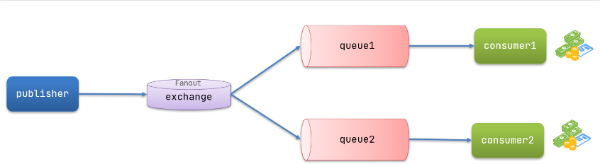

> [!note] Fanout 交换机作用
> - 接收 publisher 发送的消息
> - 将消息按照规则路由到与之绑定的队列
> - 不能缓存消息，路由失败，消息丢失
> - FanoutExchange 的会将消息路由到每个绑定的队列

##### 3.4.1.1 声明队列和交换机

1. 创建队列 `fanout.queue1` & `fanout.queue2`  
2. 队列绑定到交换机 `amq.fanout`

##### 3.4.1.2 消息发送

在 publisher 服务的 SpringAmqpTest 类中添加测试方法：

```java
/**  
 * fanoutExchange 
 */
@Test
public void testFanoutExchange() {
    // 交换机名称
    String exchangeName = "amq.fanout";
    // 消息
    String message = "hello, everyone!";
    rabbitTemplate.convertAndSend(exchangeName, "", message);
}
```

##### 3.4.1.3 消息接收

在 consumer 服务的 SpringRabbitListener 中添加两个方法，作为消费者：

```java
@RabbitListener(queues = "fanout.queue1")
public void listenFanoutQueue1(String msg) {
    System.out.println("消费者1接收到Fanout消息：【" + msg + "】");
}

@RabbitListener(queues = "fanout.queue2")
public void listenFanoutQueue2(String msg) {
    System.out.println("消费者2接收到Fanout消息：【" + msg + "】");
}
```

#### 3.4.2 Direct 交换机

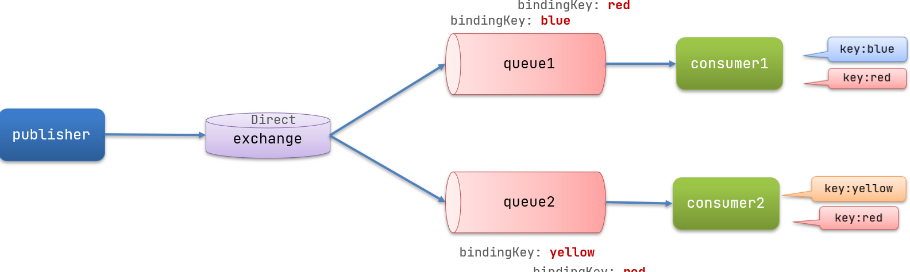

- 队列与交换机的绑定，不能是任意绑定了，而是要指定一个 `RoutingKey`（路由 key）
- 消息的发送方在向 Exchange 发送消息时，也必须指定消息的 `RoutingKey`
- Exchange 不再把消息交给每一个绑定的队列，而是根据消息的 `RoutingKey` 进行判断，只有队列的 `Routingkey` 与消息的 `Routingkey` 完全一致，才会接收到消息

> [!note] Direct 交换机与 Fanout 交换机的差异
> - Fanout 交换机将消息路由给每一个与之绑定的队列
> - Direct 交换机根据 RoutingKey 判断路由给哪个队列
> - 如果多个队列具有相同的 RoutingKey，则与 Fanout 功能类似

##### 3.4.2.1 声明队列和交换机

1. 声明队列 `direct.queue1`，绑定 `amq.direct`，`bindingKey` 为 `blud` 和 `red`
2. 声明队列 `direct.queue2`，绑定 `amq.direct`，`bindingKey` 为 `yellow` 和 `red`

##### 3.4.2.2 消息接收

在 consumer 服务的 SpringRabbitListener 中添加方法：

```java
@RabbitListener(queues = "direct.queue1")
public void listenDirectQueue1(String msg) {
    System.out.println("消费者1接收到direct.queue1的消息：【" + msg + "】");
}

@RabbitListener(queues = "direct.queue2")
public void listenDirectQueue2(String msg) {
    System.out.println("消费者2接收到direct.queue2的消息：【" + msg + "】");
}
```

##### 3.4.2.3 消息发送

在 publisher 服务的 SpringAmqpTest 类中添加测试方法：

```java
/**
 * directExchange
 */
@Test
public void testSendDirectExchange_red() {
    // 交换机名称
    String exchangeName = "amq.direct";
    // 消息
    String message = "红色警报！日本乱排核废水，导致海洋生物变异，惊现哥斯拉！";
    // 发送消息
    rabbitTemplate.convertAndSend(exchangeName, "red", message);
}

@Test
public void testSendDirectExchange_blue() {
    // 交换机名称
    String exchangeName = "amq.direct";
    // 消息
    String message = "最新报道，哥斯拉是居民自治巨型气球，虚惊一场！";
    // 发送消息
    rabbitTemplate.convertAndSend(exchangeName, "blue", message);
}
```

#### 3.4.3 Topic 交换机

##### 3.4.3.1 说明

`Topic`类型的`Exchange`支持在绑定队列时使用通配符，实现更灵活的消息路由：

- **通配符规则：**
	- `#`：匹配一个或多个单词
	- `*`：匹配恰好一个单词
- **示例：**
	- `BindingKey: item.#` -> 匹配 `RoutingKey: item.spu.insert` 或 `item.spu`
	- `BindingKey: item.*` -> 仅匹配 `RoutingKey: item.spu`

这种方式使得一个队列可以接收来自不同但相关路由键的消息，提高了消息传递的灵活性和效率。

> [!note] Direct 交换机与 Topic 交换机的差异
> - Topic 交换机接收的消息 RoutingKey 必须是多个单词，以 `**.**` 分割
> - Topic 交换机与队列绑定时的 bindingKey 可以指定通配符
> - `#`：代表 1~n 词
> - `*`：代表 1 个词

##### 3.4.3.2 声明队列和交换机

- 假如此时 publisher 发送的消息使用的 `RoutingKey` 共有四种
	- `china.news ` 代表有中国的新闻消息
	- `china.weather` 代表中国的天气消息
	- `japan.news` 则代表日本新闻
	- `japan.weather` 代表日本的天气消息

1. 声明队列 `topic.queue1`，绑定 `amq.topic`，`bindingKey` 为 `china.#`
2. 声明队列 `topic.queue2`，绑定 `amq.topic`，`bindingKey` 为 `#.news`

##### 3.4.3.3 消息发送

在 publisher 服务的 SpringAmqpTest 类中添加测试方法：

```java
/**
 * topicExchange
 */
@Test
public void testSendTopicExchange() {
    // 交换机名称
    String exchangeName = "amq.topic";
    // 消息
    String message = "喜报！孙悟空大战哥斯拉，胜!";
    // 发送消息
    rabbitTemplate.convertAndSend(exchangeName, "china.news", message);
}
```

##### 3.4.3.4 消息接收

在 consumer 服务的 SpringRabbitListener 中添加方法：

```java
@RabbitListener(queues = "topic.queue1")
public void listenTopicQueue1(String msg){
    System.out.println("消费者1接收到topic.queue1的消息：【" + msg + "】");
}

@RabbitListener(queues = "topic.queue2")
public void listenTopicQueue2(String msg){
    System.out.println("消费者2接收到topic.queue2的消息：【" + msg + "】");
}
```

#### 3.4.4 声明队列和交换机

程序启动时检查队列和交换机是否存在，如果不存在自动创建。

##### 3.4.4.1 基本 API

- **Queue:**
	- `Queue(String name)`: 创建一个名为 name 的队列
- **Exchange:**
	- 接口，表示不同类型的交换机
- **ExchangeBuilder:**
	- `directExchange(String name)`: 创建一个 DirectExchange
	- `topicExchange(String name)`: 创建一个 TopicExchange
	- `fanoutExchange(String name)`: 创建一个 FanoutExchange
- **BindingBuilder:**
	- `bind(Queue queue)`: 绑定队列
	- `to(Exchange exchange)`: 到指定的交换机
	- `with(String routingKey)`: 使用指定的路由键

##### 3.4.4.2 Fanout 示例

在 consumer 中创建一个类，声明队列和交换机：

```java
package org.example.publisher.config;

import org.springframework.amqp.core.Binding;
import org.springframework.amqp.core.BindingBuilder;
import org.springframework.amqp.core.FanoutExchange;
import org.springframework.amqp.core.Queue;
import org.springframework.context.annotation.Bean;
import org.springframework.context.annotation.Configuration;

@Configuration
public class FanoutConfig {
	/**
	 * 声明交换机
	 *
	 * @return Fanout类型交换机
	 */
	@Bean
	public FanoutExchange fanoutExchange() {
		return new FanoutExchange("amq.fanout");
	}

	/**
	 * 第1个队列
	 */
	@Bean
	public Queue fanoutQueue1() {
		return new Queue("fanout.queue1");
	}

	/**
	 * 绑定队列和交换机
	 */
	@Bean
	public Binding bindingQueue1(Queue fanoutQueue1, FanoutExchange fanoutExchange) {
		return BindingBuilder.bind(fanoutQueue1).to(fanoutExchange);
	}

	/**
	 * 第2个队列
	 */
	@Bean
	public Queue fanoutQueue2() {
		return new Queue("fanout.queue2");
	}

	/**
	 * 绑定队列和交换机
	 */
	@Bean
	public Binding bindingQueue2(Queue fanoutQueue2, FanoutExchange fanoutExchange) {
		return BindingBuilder.bind(fanoutQueue2).to(fanoutExchange);
	}
}
```

##### 3.4.4.3 Direct 示例

```java
package org.example.publisher.config;  
  
import org.springframework.amqp.core.*;  
import org.springframework.context.annotation.Bean;  
import org.springframework.context.annotation.Configuration;  
  
@Configuration  
public class DirectConfig {  
  
    /**  
     * 声明交换机  
     *  
     * @return Direct类型交换机  
     */  
    @Bean  
    public DirectExchange directExchange() {  
       return ExchangeBuilder.directExchange("amq.direct").build();  
    }  
  
    /**  
     * 第1个队列  
     */  
    @Bean  
    public Queue directQueue1() {  
       return new Queue("direct.queue1");  
    }  
  
    /**  
     * 绑定队列和交换机  
     */  
    @Bean  
    public Binding bindingQueue1WithRed(Queue directQueue1, DirectExchange directExchange) {  
       return BindingBuilder.bind(directQueue1).to(directExchange).with("red");  
    }  
  
    /**  
     * 绑定队列和交换机  
     */  
    @Bean  
    public Binding bindingQueue1WithBlue(Queue directQueue1, DirectExchange directExchange) {  
       return BindingBuilder.bind(directQueue1).to(directExchange).with("blue");  
    }  
  
    /**  
     * 第2个队列  
     */  
    @Bean  
    public Queue directQueue2() {  
       return new Queue("direct.queue2");  
    }  
  
    /**  
     * 绑定队列和交换机  
     */  
    @Bean  
    public Binding bindingQueue2WithRed(Queue directQueue2, DirectExchange directExchange) {  
       return BindingBuilder.bind(directQueue2).to(directExchange).with("red");  
    }  
  
    /**  
     * 绑定队列和交换机  
     */  
    @Bean  
    public Binding bindingQueue2WithYellow(Queue directQueue2, DirectExchange directExchange) {  
       return BindingBuilder.bind(directQueue2).to(directExchange).with("yellow");  
    }  
}
```

##### 3.4.4.4 基于注解声明

基于@Bean 的方式声明队列和交换机比较麻烦，Spring 还提供了基于注解方式来声明。

```java
@RabbitListener(bindings = @QueueBinding(
    value = @Queue(name = "direct.queue1"),
    exchange = @Exchange(name = "amq.direct", type = ExchangeTypes.DIRECT),
    key = {"red", "blue"}
))
public void listenDirectQueue1(String msg){
    System.out.println("消费者1接收到direct.queue1的消息：【" + msg + "】");
}

@RabbitListener(bindings = @QueueBinding(
    value = @Queue(name = "direct.queue2"),
    exchange = @Exchange(name = "amq.direct", type = ExchangeTypes.DIRECT),
    key = {"red", "yellow"}
))
public void listenDirectQueue2(String msg){
    System.out.println("消费者2接收到direct.queue2的消息：【" + msg + "】");
}

@RabbitListener(bindings = @QueueBinding(
    value = @Queue(name = "topic.queue1"),
    exchange = @Exchange(name = "amq.topic", type = ExchangeTypes.TOPIC),
    key = "china.#"
))
public void listenTopicQueue1(String msg){
    System.out.println("消费者1接收到topic.queue1的消息：【" + msg + "】");
}

@RabbitListener(bindings = @QueueBinding(
    value = @Queue(name = "topic.queue2"),
    exchange = @Exchange(name = "amq.topic", type = ExchangeTypes.TOPIC),
    key = "#.news"
))
public void listenTopicQueue2(String msg){
    System.out.println ("消费者 2 接收到 topic. queue 2 的消息：【" + msg + "】");
}
```

## 4 消息转换器

- Spring 在发送消息时，默认会将消息体（Object 类型）通过 JDK 序列化转换为字节流，发送给消息队列。在接收消息时，同样会将字节流反序列化为 Java 对象
- 实际应用中通常会选择其他序列化方式，如 JSON 序列化等

> [!note] JDK 序列化存在问题
> - 数据体积过大
> - 有安全漏洞
> - 可读性差

### 4.1 配置 JSON 转换器

为了减小消息体积并提高可读性，我们可以使用 JSON 序列化方式。

1. **引入依赖：**

   在 `publisher` 和 `consumer` 服务中引入 `jackson-dataformat-xml` 依赖，但如果项目已引入 `spring-boot-starter-web`，则无需重复引入。

2. **配置消息转换器：**

   在 `publisher` 和 `consumer` 服务的启动类中添加 Bean：

   ```java
	@Bean
	public MessageConverter messageConverter() {
		Jackson2JsonMessageConverter converter = new Jackson2JsonMessageConverter();
		converter.setCreateMessageIds(true);
		return converter;
	}
   ```

   配置说明：

   - `Jackson2JsonMessageConverter`: 使用 Jackson 库进行 JSON 序列化和反序列化。
   - `setCreateMessageIds(true)`: 自动生成消息 ID，方便后续消息去重和幂等性处理。

### 4.2 生产者发出 Object

在 `consumer` 中声明一个新的配置类，通过 `@Bean` 新建一个队列

```java
package org.example.consumer.config;  
  
import org.springframework.amqp.core.Queue;  
import org.springframework.context.annotation.Bean;  
import org.springframework.context.annotation.Configuration;  
  
@Configuration  
public class MessageConfig {  
  
    @Bean  
    public Queue objectQueue() {  
       return new Queue("object.queue");  
    }  
}
```

在 `publisher` 的 `SpringAmqpTest` 中新增一个消息发送的代码，发送一个Map对象

```java
@Test  
public void testSendMap() throws InterruptedException {  
    // 准备消息  
    Map<String, Object> msg = new HashMap<>();  
    msg.put("name", "柳岩");  
    msg.put("age", 21);  
    // 发送消息  
    rabbitTemplate.convertAndSend("object.queue", msg);  
}
```

### 4.3 消费者接收 Object

```java
// 消费者监听object.queue队列  
// 测试JSON序列化  
@RabbitListener(queues = "object.queue")  
public void listenSimpleQueueMessage(Map<String, Object> msg) throws InterruptedException {  
    System.out.println("消费者接收到object.queue消息：【" + msg + "】");  
}
```

## 5 业务改造

案例需求：改造余额支付功能，将支付成功后基于 OpenFeign 的交易服务的更新订单状态接口的同步调用，改为基于 RabbitMQ 的异步通知。  

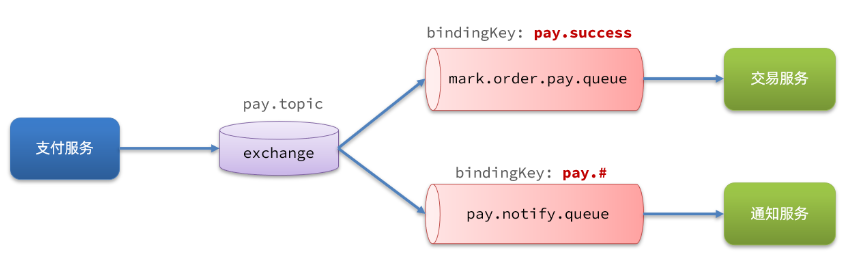

- 只关注交易服务，步骤如下：
	- 定义 topic 类型交换机，命名为`pay.topic`
	- 定义消息队列，命名为`mark.order.pay.queue`
	- 将`mark.order.pay.queue`与`pay.topic`绑定，`BindingKey`为`pay.success`
	- 支付成功时不再调用交易服务更新订单状态的接口，而是发送一条消息到`pay. topic`，发送消息的`RoutingKey` 为`pay.success`，消息内容是订单 id
	- 交易服务监听`mark.order.pay.queue`队列，接收到消息后更新订单状态为已支付

### 5.1 配置 MQ

不管是生产者还是消费者，都需要配置 MQ 的基本信息

```xml
<!--AMQP依赖，包含RabbitMQ-->  
<dependency>  
    <groupId>org.springframework.boot</groupId>  
    <artifactId>spring-boot-starter-amqp</artifactId>  
</dependency>
```

```yaml
logging:  
  pattern:  
    dateformat: MM-dd HH:mm:ss:SSS  # 日志格式
spring:  
  rabbitmq:  
    host: aliyun # 你的虚拟机IP  
    port: 5672 # 端口  
    virtual-host: /test # 虚拟主机  
    username: test # 用户名  
    password: test # 密码  
    listener:  
      simple:  
        prefetch: 1 # 每次只能获取一条消息，处理完成才能获取下一个消息
```

> [!note] `spring.rabbit.listener.simple.prefetch`
> - 对于消息处理顺序有严格要求的场景，建议使用 prefetch=1
> - 对于消息处理时间较短、吞吐量要求较高的场景，可以适当增加 prefetch 值，例如设置为 10 或 20
> - 可以通过监控消费者负载和消息积压情况，动态调整 prefetch 值，以达到最佳性能

### 5.2 接收消息

在 trade-service 服务中定义一个消息监听类：  

```java
@Component
@RequiredArgsConstructor
public class PayStatusListener {

    private final IOrderService orderService;

    @RabbitListener (bindings = @QueueBinding (
            value = @Queue (name = "mark.order.pay.queue", durable = "true"),
            exchange = @Exchange (name = "pay.topic", type = ExchangeTypes. TOPIC),
            key = "pay.success"
    ))
    public void listenPaySuccess (Long orderId){
        orderService.markOrderPaySuccess (orderId);
    }
}
```

### 5.3 发送消息

修改 `pay-service` 服务下的 `org.example.pay.service.impl.PayOrderServiceImpl` 类中的 `tryPayOrderByBalance` 方法：

```java
private final RabbitTemplate rabbitTemplate;

@Override
@Transactional
public void tryPayOrderByBalance (PayOrderDTO payOrderDTO) {
    // 1. 查询支付单
    PayOrder po = getById(payOrderDTO.getId());
    // 2. 判断状态
    if (!PayStatus.WAIT_BUYER_PAY.equalsValue(po.getStatus())){
        // 订单不是未支付，状态异常
        throw new BizIllegalException("交易已支付或关闭！");
    }
    // 3. 尝试扣减余额
    userClient.deductMoney(payOrderDTO.getPw(), po.getAmount());
    // 4. 修改支付单状态
    boolean success = markPayOrderSuccess(payOrderDTO.getId(), LocalDateTime.now());
    if (!success) {
        throw new BizIllegalException("交易已支付或关闭！");
    }
    // 5. 修改订单状态
    // tradeClient.markOrderPaySuccess (po.getBizOrderNo ());
    try {
        rabbitTemplate.convertAndSend("pay.topic", "pay.success", po.getBizOrderNo());
    } catch (Exception e) {
        log.error("支付成功的消息发送失败，支付单 id：{}，交易单 id：{}", po.getId(), po.getBizOrderNo(), e);
    }
}
```

> [!note] 优雅传递用户信息  
> **方案：**
>
> 1. **消息发送端：** 在发送消息前，将当前登录用户信息（例如用户 ID）存储到消息头（Message Header）中。可以使用 Spring AMQP 提供的 `MessageBuilder` 或 `MessageProperties` 来设置消息头。
>
> 2. **消息接收端：** 在消息监听器（Message Listener）中，从消息头中获取登录用户信息。然后，可以使用 ThreadLocal 将用户信息存储在当前线程的上下文（UserContext）中。这样，在后续的业务处理逻辑中，就可以通过 UserContext 方便地获取到登录用户信息。
>
> 3. **AOP 切面（可选）：** 为了避免在每个消息监听器中都重复编写获取用户信息并设置 UserContext 的逻辑，可以考虑使用 AOP 切面来统一处理。在切面中，拦截消息监听方法，从消息头中获取用户信息并设置 UserContext，然后执行原始的监听方法。
>
> **优点：**
>
> - **透明传递：** 使用消息头传递用户信息，对消息发送者和接收者来说是透明的，无需修改业务代码。
> - **统一获取：** 使用 UserContext 统一获取登录用户信息，保持了编程体验的一致性。
> - **灵活扩展：** 可以根据需要在消息头中传递其他上下文信息，例如请求 ID、跟踪信息等。
>
> **注意事项：**
>
> - 需要保证 UserContext 的线程安全性，例如使用 ThreadLocal 来存储用户信息。
> - 在分布式系统中，需要考虑用户信息在不同服务节点之间的传递和一致性。
> - 如果消息头大小有限制，可以考虑将用户信息存储在消息体中，但需要对消息体进行序列化和反序列化。

## 6 发送者的可靠性

- 消息从生产者到消费者的每一步都可能导致消息丢失
	- **发送消息时丢失**
	   - 生产者发送消息时连接 MQ 失败
	   - 生产者发送消息到达 MQ 后未找到 `Exchange`
	   - 生产者发送消息到达 MQ 的 `Exchange` 后，未找到合适的 `Queue`
	   - 消息到达 MQ 后，处理消息的进程发生异常
	- **MQ 导致消息丢失**
	   - 消息到达 MQ，保存到队列后，尚未消费就突然宕机
	- **消费者处理消息时**
	   - 消息接收后尚未处理突然宕机
	   - 消息接收后处理过程中抛出异常
- 解决消息丢失问题，保证 MQ 的可靠性
	- 确保生产者一定把消息发送到 MQ
	- 确保 MQ 不会将消息弄丢
	- 确保消费者一定要处理消息

### 6.1 生产者重试机制

> [!warning]  
> **注意**：当网络不稳定的时候，利用重试机制可以有效提高消息发送的成功率。不过 SpringAMQP 提供的重试机制是**阻塞式**的重试，也就是说多次重试等待的过程中，当前线程是被阻塞的。  
> 如果对于业务性能有要求，建议禁用重试机制。如果一定要使用，请合理配置等待时长和重试次数，当然也可以考虑使用异步线程来执行发送消息的代码。  
首先第一种情况，就是生产者发送消息时，出现了网络故障，导致与 MQ 的连接中断。

为了解决这个问题，SpringAMQP 提供的消息发送时的重试机制。即：当 `RabbitTemplate` 与 MQ 连接超时后，多次重试。

修改 `publisher` 模块的 `application.yaml` 文件，添加下面的内容：

```yaml
spring:
  rabbitmq:
    connection-timeout: 1s # 设置MQ的连接超时时间
    template:
      retry:
        enabled: true # 开启超时重试机制
        initial-interval: 1000ms # 失败后的初始等待时间
        multiplier: 1 # 失败后下次的等待时长倍数，下次等待时长 = initial-interval * multiplier
        max-attempts: 3 # 最大重试次数
```

我们利用命令停掉 RabbitMQ 服务：

```shell
docker stop mq
```

然后测试发送一条消息，会发现会每隔 1 秒重试 1 次，总共重试了 3 次。消息发送的超时重试机制配置成功了！

### 6.2 生产者确认机制

- 一般情况下，生产者与 MQ 网络连接正常，消息不会丢失
- 少数情况下，消息可能会丢失，主要有
   - MQ 内部处理消息异常
   - 消息未找到 `Exchange`
   - 消息未找到合适的 `Queue`
- RabbitMQ 提供了生产者消息确认机制 (默认关闭，通过配置文件开启)
   - Publisher Confirm: `ack` 投递成功, `nack` 投递失败
   - Publisher Return: 路由失败时返回异常信息

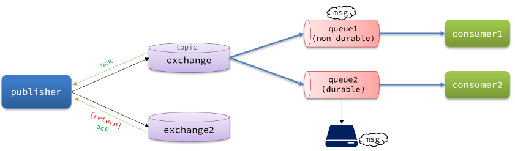  

- 当消息投递到 MQ，但是路由失败时，通过 **Publisher Return** 返回异常信息，同时返回 ACK 的确认信息，代表投递成功
- 临时消息投递到了 MQ，并且入队成功，返回 ACK，告知投递成功
- 持久消息投递到了 MQ，并且入队完成持久化，返回 ACK ，告知投递成功
- 其它情况都会返回 NACK，告知投递失败

### 6.3 实现生产者确认

> [!warning ]  
> 开启生产者确认比较消耗 MQ 性能，一般不建议开启
>
> - **confirmCallback**：用于确认消息是否成功到达 exchange，返回 `ACK/NACK`
> - **returnCallback**：用于处理消息无法路由到 queue 的情况  
>
> 触发确认的几种情况：
> - 路由失败：一般是因为 RoutingKey 错误导致，往往是编程导致
> - 交换机名称错误：同样是编程错误导致
> - MQ 内部故障：这种需要处理，但概率往往较低。因此只有对消息可靠性要求非常高的业务才需要开启，而且仅仅需要开启 ConfirmCallback 处理 nack

#### 6.3.1 开启生产者确认

在 publisher 模块的 `application.yaml` 中添加配置：

```yaml
spring:
  rabbitmq:
    publisher-confirm-type: correlated # 开启publisher confirm机制，并设置confirm类型
    publisher-returns: true # 开启publisher return机制
```

这里 `publisher-confirm-type` 有三种模式可选：

- `none`：关闭 confirm 机制
- `simple`：同步阻塞等待 MQ 的回执
- `correlated`：MQ 异步回调返回回执

一般我们推荐使用 `correlated`，回调机制。

#### 6.3.2 定义 ReturnCallback

每个 `RabbitTemplate` 只能配置一个 `ReturnCallback`，因此我们可以在配置类中统一设置。我们在 publisher 模块定义一个配置类：  

```java
package org.example.publisher.config;  
  
import lombok.AllArgsConstructor;  
import lombok.extern.slf4j.Slf4j;  
import org.springframework.amqp.core.ReturnedMessage;  
import org.springframework.amqp.rabbit.core.RabbitTemplate;  
import org.springframework.context.annotation.Configuration;  
  
import javax.annotation.PostConstruct;  
  
@Slf4j  
@AllArgsConstructor  
@Configuration  
public class MqConfig {  
    private final RabbitTemplate rabbitTemplate;  
  
    @PostConstruct  
    public void init() {  
       rabbitTemplate.setReturnsCallback(new RabbitTemplate.ReturnsCallback() {  
          @Override  
          public void returnedMessage(ReturnedMessage returned) {  
             log.error("触发return callback,");  
             log.debug("exchange: {}", returned.getExchange());  
             log.debug("routingKey: {}", returned.getRoutingKey());  
             log.debug("message: {}", returned.getMessage());  
             log.debug("replyCode: {}", returned.getReplyCode());  
             log.debug("replyText: {}", returned.getReplyText());  
          }  
       });  
    }  
}
```

#### 6.3.3 定义 ConfirmCallback

- 由于每个消息发送时的处理逻辑不一定相同，因此 ConfirmCallback 需要在每次发消息时定义
- 具体来说，是在调用 RabbitTemplate 中的 convertAndSend 方法时，多传递一个参数：
	- `convertAndSend(String, String, Object, CorrelationData): void`  
		- 这里的 `CorrelationData` 中包含两个核心的东西：
			- `id`：消息的唯一标示，MQ 对不同的消息的回执以此做判断，避免混淆
			- `SettableListenableFuture`：回执结果的 Future 对象
				- 将来 MQ 的回执就会通过这个 `Future` 来返回，我们可以提前给 `CorrelationData` 中的 `Future` 添加回调函数来处理消息回执：  
					- `addCallback(ListenableFutureCallback<? super T>): void`

我们新建一个测试，向系统自带的交换机发送消息，并且添加 `ConfirmCallback`：

```java
@Test  
public void testPublisherConfirm() {  
    // 1.创建CorrelationData  
    CorrelationData cd = new CorrelationData();  
    // 2.给Future添加ConfirmCallback  
    cd.getFuture().addCallback(new ListenableFutureCallback<CorrelationData.Confirm>() {  
  
       @Override  
       public void onFailure(Throwable ex) {  
          // 2.1.Future发生异常时的处理逻辑，基本不会触发  
          log.error("send message fail", ex);  
       }  
  
       @Override  
       public void onSuccess(CorrelationData.Confirm result) {  
          // 2.2.Future接收到回执的处理逻辑，参数中的result就是回执内容  
          if (result.isAck()) { // result.isAck()，boolean类型，true代表ack回执，false 代表 nack回执  
             log.debug("发送消息成功，收到 ack!");  
          } else { // result.getReason()，String类型，返回nack时的异常描述  
             log.error("发送消息失败，收到 nack, reason : {}", result.getReason());  
          }  
       }  
    });  
    // 3.发送消息  
    rabbitTemplate.convertAndSend("amq.direct", "q", "hello", cd);  
}
```

- 执行结果由于传递的 `RoutingKey` 是错误的，路由失败后，触发了 `return callback`，同时也收到了 ack
- 修改为正确的 `RoutingKey` 以后，就不会触发 `return callback` 了，只收到 ack
- 而如果连交换机都是错误的，则只会收到 nack

## 7 MQ 的可靠性

消息到达 MQ 以后，如果 MQ 不能及时保存，也会导致消息丢失，所以 MQ 的可靠性也非常重要。

### 7.1 数据持久化

> [!warning] 持久化+生产者确认  
> 在开启持久化机制以后，如果同时还开启了生产者确认，那么 MQ 会在消息持久化以后才发送 ACK 回执，进一步确保消息的可靠性。  
> 不过出于性能考虑，为了减少 IO 次数，发送到 MQ 的消息并不是逐条持久化到数据库的，而是每隔一段时间批量持久化。一般间隔在 100 毫秒左右，这就会导致 ACK 有一定的延迟，因此建议生产者确认全部采用异步方式。  
为了提升性能，默认情况下 MQ 的数据都是在内存存储的临时数据，重启后就会消失。为了保证数据的可靠性，必须配置数据持久化，包括：

- 交换机持久化
- 队列持久化
- 消息持久化
	- `delivery_mode=`
		- - **1 (Non-Persistent):**
			- 消息不会被持久化到磁盘，而是存储在内存中。
			- 当RabbitMQ服务器重启或者崩溃时，这些消息将会丢失。
			- 适用于对消息可靠性要求不高的场景，例如日志记录、实时数据传输等。
		- **2 (Persistent):**
			- 消息会被持久化到磁盘，即使RabbitMQ服务器重启或者崩溃，消息也不会丢失。
			- 在发布消息时，RabbitMQ会将消息写入磁盘上的持久化日志文件。
			- 适用于对消息可靠性要求较高的场景，例如订单处理、金融交易等。

- `Durability`
	- `Durable` => 持久化模式
	- `Transient` => 临时模式

### 7.2 LazyQueue

RabbitMQ 默认将消息存储在内存中以提高性能。然而，当消息积压时，内存占用会增加，可能触发内存预警并导致消息刷盘（PageOut），影响性能。

为解决此问题，RabbitMQ 3.6.0 引入了惰性队列（Lazy Queue），其特点是：

- 消息直接存入磁盘，而非内存
- 消费者消费时才加载到内存（懒加载）
- 支持数百万条消息存储

从 3.12 版本开始，Lazy Queue 成为默认模式。建议升级到 3.12 或将所有队列设置为 Lazy Queue 模式。

#### 7.2.1 控制台配置 Lazy 模式

添加队列时，添加 `x-queue-mod=lazy` 参数

#### 7.2.2 代码配置 Lazy 模式

在利用 SpringAMQP 声明队列的时候，添加 `x-queue-mod=lazy` 参数也可设置队列为 Lazy 模式：

```java
@Bean
public Queue lazyQueue(){
    return QueueBuilder
            .durable("lazy.queue")
            .lazy() // 开启Lazy模式
            .build();
}
```

这里是通过 `QueueBuilder` 的 `lazy()` 函数配置 Lazy 模式，底层源码如下：  

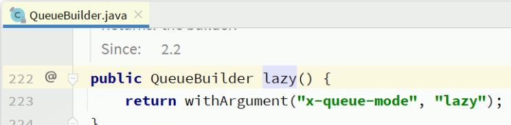

当然，我们也可以基于注解来声明队列并设置为 Lazy 模式：

```java
@RabbitListener(queuesToDeclare = @Queue(
        name = "lazy.queue",
        durable = "true",
        arguments = @Argument(name = "x-queue-mode", value = "lazy")
))
public void listenLazyQueue(String msg){
    log.info("接收到 lazy.queue的消息：{}", msg);
}
```

#### 7.2.3 更新已有队列为 Lazy 模式

对于已经存在的队列，也可以配置为 lazy 模式，但是要通过设置 policy 实现。  
可以基于命令行设置 policy：

```shell
rabbitmqctl set_policy Lazy "^lazy-queue$" '{"queue-mode":"lazy"}' --apply-to queues  
```

命令解读：

- `rabbitmqctl` ：RabbitMQ 的命令行工具
- `set_policy` ：添加一个策略
- `Lazy` ：策略名称，可以自定义
- `"^lazy-queue$"` ：用正则表达式匹配队列的名字
- `'{"queue-mode":"lazy"}'` ：设置队列模式为 lazy 模式
- `--apply-to queues`：策略的作用对象，是所有的队列

当然，也可以在控制台配置 policy，进入在控制台的 `Admin` 页面，点击 `Policies`，即可添加配置

## 8 消费者的可靠性

- 消息投递的过程中出现了网络故障
- 消费者接收到消息后突然宕机
- 消费者接收到消息后，因处理不当导致异常

一旦发生上述情况，消息也会丢失。因此，RabbitMQ 必须知道消费者的处理状态，一旦消息处理失败才能重新投递消息。  

### 8.1 消费者确认机制

RabbitMQ提供消费者确认机制（Consumer Acknowledgement）以确保消息被成功处理。消费者在处理完消息后，向RabbitMQ发送回执告知处理状态：

- **ack:** 成功处理，RabbitMQ删除消息
- **nack:** 处理失败，RabbitMQ重新投递消息
- **reject:** 处理失败并拒绝，RabbitMQ删除消息

reject通常用于消息格式错误等开发问题。一般情况下，使用try-catch捕获异常，成功返回ack，失败返回nack。

Spring AMQP 实现了消息确认，并提供了三种 ACK 处理模式：

- **none:** 不处理，消息投递后立即 ack，不安全，不建议使用。
- **manual:** 手动模式，在业务代码中调用 API 发送 ack 或 reject，灵活但存在业务入侵。
- **auto:** 自动模式，Spring AMQP 使用 AOP 对消息处理逻辑进行环绕增强，根据情况自动返回 `ack`、`nack` 或 `reject`
	- **消息处理成功**时返回 `ack`
	- **业务异常**时返回 `nack`
	- **消息处理或校验异常**时返回 `reject`

返回 Reject 的常见异常有：

Starting with version 1.3.2, the default ErrorHandler is now a ConditionalRejectingErrorHandler that rejects (and does not requeue) messages that fail with an irrecoverable error. Specifically, it rejects messages that fail with the following errors:

```java
- o.s.amqp…MessageConversionException: Can be thrown when converting the incoming message payload using a MessageConverter.
- o.s.messaging…MessageConversionException: Can be thrown by the conversion service if additional conversion is required when mapping to a @RabbitListener method.
- o.s.messaging…MethodArgumentNotValidException: Can be thrown if validation (for example, @Valid) is used in the listener and the validation fails.
- o.s.messaging…MethodArgumentTypeMismatchException: Can be thrown if the inbound message was converted to a type that is not correct for the target method. For example, the parameter is declared as Message<Foo> but Message<Bar> is received.
- java. lang. NoSuchMethodException: Added in version 1.6.3.
- java. lang. ClassCastException: Added in version 1.6.3.
```

通过下面的配置可以修改 SpringAMQP 的 ACK 处理方式：

```yaml
spring:
  rabbitmq:
    listener:
      simple:
        acknowledge-mode: none # 不做处理
```

修改 consumer 服务的 SpringRabbitListener 类中的方法，模拟一个消息处理的异常：

```java
// 模拟消息转换异常  
@RabbitListener(queues = "simple.queue")  
public void listenSimpleQueueMessage_mcErr(String msg) throws InterruptedException {  
    log.info("spring 消费者接收到消息：【{}】", msg);  
    throw new MessageConversionException("故意的");  
}
```

测试可以发现：当消息处理发生异常时，消息依然被 RabbitMQ 删除了。

我们再次把确认机制修改为 auto：

```yaml
spring:
  rabbitmq:
    listener:
      simple:
        acknowledge-mode: auto # 自动 ack
```

在异常位置打断点，再次发送消息，程序卡在断点时，可以发现此时消息状态为 `unacked`

放行以后，由于抛出的是**消息转换异常**，因此 Spring 会自动返回`reject`，所以消息依然会被删除

我们将异常改为 RuntimeException 类型：

```java
// 模拟运行时异常  
@RabbitListener(queues = "simple.queue")  
public void listenSimpleQueueMessage_rtErr(String msg) throws InterruptedException {  
    log.info("spring 消费者接收到消息：【{}】", msg);  
    throw new RuntimeException("故意的");  
}
```

在异常位置打断点，然后再次发送消息测试，程序卡在断点时，可以发现此时消息状态为 `unacked`

 放行以后，由于抛出的是业务异常，所以 Spring 返回 `nack`，最终消息恢复至 `Ready` 状态，并且没有被 RabbitMQ 删除

当我们把配置改为`auto`时，消息处理失败后，会回到 RabbitMQ，并重新投递到消费者。

### 8.2 失败重试机制

当消费者出现异常后，消息会不断 requeue（重入队）到队列，再重新发送给消费者。直到消息处理成功为止。  

Spring 又提供了消费者失败重试机制：在消费者出现异常时利用本地重试，而不是无限制的 requeue 到 mq 队列。

修改 consumer 服务的 application. yml 文件，添加内容：

```yaml
spring:
  rabbitmq:
    listener:
      simple:
        retry:
          enabled: true # 开启消费者失败重试
          initial-interval: 1000ms # 初识的失败等待时长为 1 秒
          multiplier: 1 # 失败的等待时长倍数，下次等待时长 = multiplier * last-interval
          max-attempts: 3 # 最大重试次数
          stateless: true # true 无状态；false 有状态。如果业务中包含事务，这里改为 false
```

- 开启本地重试时，消息处理过程中抛出异常，不会 requeue 到队列，而是在消费者本地重试
- 重试达到最大次数后，Spring 会返回 reject，消息会被丢弃

> [!note] 本地重试的具体情况  
> **返回 nack：**
> 1. Spring AMQP 会根据配置将消息重新放回队列（requeue），默认放回队列头部。
> 2. 消息可能被立即重新投递给同一个消费者，导致立即重试。
> 3. 您可以通过设置 `requeueRejected` 参数为 false，将消息放回队列尾部，避免立即重试。
> 4. 如果重试次数达到上限，Spring AMQP 会返回 reject，消息会被丢弃或进入死信队列。
>
> **返回 reject：**
>
> 1. Spring AMQP 默认会丢弃消息或将其放入死信队列。
> 2. 不会立即触发重试。
> 3. 如果配置了 `RepublishMessageRecoverer`，消息会被重新发布到其他队列，实现另一种形式的重试。
> 4. 如果没有配置 `RepublishMessageRecoverer`，重试次数达到上限后，消息会被丢弃或进入死信队列。

### 8.3 失败处理策略

在Spring AMQP中，当消息处理达到最大重试次数后，默认会直接丢弃消息。但对于可靠性要求较高的场景，这种处理方式并不合适。

因此，Spring AMQP允许自定义重试耗尽后的消息处理策略，通过`MessageRecovery`接口的三个实现来定义：

1. **`RejectAndDontRequeueRecoverer`:** 重试耗尽后，直接`reject`，丢弃消息（默认）。
2. **`ImmediateRequeueMessageRecoverer`:** 重试耗尽后，返回`nack`，消息重新入队。
3. **`RepublishMessageRecoverer`:** 重试耗尽后，将失败消息投递到指定的交换机。

其中，`RepublishMessageRecoverer` 是一种更优雅的处理方案。它将失败消息投递到专门的异常消息队列，方便后续人工集中处理。  

在 consumer 服务中定义处理失败消息的交换机和队列

```java
package org.example.consumer.config;  
  
import org.springframework.amqp.core.Binding;  
import org.springframework.amqp.core.BindingBuilder;  
import org.springframework.amqp.core.DirectExchange;  
import org.springframework.amqp.core.Queue;  
import org.springframework.amqp.rabbit.core.RabbitTemplate;  
import org.springframework.amqp.rabbit.retry.MessageRecoverer;  
import org.springframework.amqp.rabbit.retry.RepublishMessageRecoverer;  
import org.springframework.boot.autoconfigure.condition.ConditionalOnProperty;  
import org.springframework.context.annotation.Bean;  
import org.springframework.context.annotation.Configuration;  
  
@Configuration  
@ConditionalOnProperty(name = "spring.rabbitmq.listener.simple.retry.enabled", havingValue = "true")  
public class ErrorMessageConfig {  
    @Bean  
    public DirectExchange errorMessageExchange() {  
       return new DirectExchange("error.direct");  
    }  
  
    @Bean  
    public Queue errorQueue() {  
       return new Queue("error.queue", true);  
    }  
  
    @Bean  
    public Binding errorBinding(Queue errorQueue, DirectExchange errorMessageExchange) {  
       return BindingBuilder.bind(errorQueue).to(errorMessageExchange).with("error");  
    }  
  
    @Bean  
    public MessageRecoverer republishMessageRecoverer(RabbitTemplate rabbitTemplate) {  
       return new RepublishMessageRecoverer(rabbitTemplate, "error.direct", "error");  
    }  
}
```

### 8.4 业务幂等性

在程序开发中，幂等性是指同一个业务操作，无论执行一次还是多次，对业务状态的影响都保持一致。然而，在实际业务场景中，由于意外情况（如页面卡顿、服务重试、MQ消息重复投递），业务操作可能会被重复执行，从而导致业务异常。

以支付成功后发送MQ消息通知交易服务为例，若消息重复投递，可能导致订单状态在已支付和已退款之间反复切换。

为保证消息处理的幂等性，可以采用以下两种方案：

1. **唯一消息ID：**
   - 为每条消息分配一个全局唯一的ID。
   - 在处理消息前，先检查该消息ID是否已被处理过。
   - 如果已处理过，则直接忽略该消息；否则，正常处理并记录消息ID。

2. **业务状态判断：**
   - 在处理消息前，先查询相关的业务状态。
   - 根据业务状态判断是否需要执行操作。
   - 例如，在处理支付成功消息时，先查询订单状态是否为未支付。
   - 如果订单已支付或已退款，则忽略该消息。

通过以上两种方案，可以有效保证消息处理的幂等性，避免因重复执行导致的业务异常。

#### 8.4.1 唯一消息 ID

给消息添加唯一 ID：`SpringAMQP` 的 `MessageConverter` 自带了 `MessageID` 的功能

以 Jackson 的消息转换器为例：

```java
@Bean  
public MessageConverter messageConverter() {  
    Jackson2JsonMessageConverter converter = new Jackson2JsonMessageConverter();  
    converter.setCreateMessageIds(true);  
    return converter;  
}
```

#### 8.4.2 业务判断

以支付修改订单的业务为例，我们需要修改`OrderServiceImpl`中的`markOrderPaySuccess`方法：

```java
    @Override
    public void markOrderPaySuccess (Long orderId) {
        // 1. 查询订单
        Order old = getById (orderId);
        // 2. 判断订单状态
        if (old == null || old.getStatus () != 1) {
            // 订单不存在或者订单状态不是 1，放弃处理
            return;
        }
        // 3. 尝试更新订单
        Order order = new Order ();
        order.setId (orderId);
        order.setStatus (2);
        order.setPayTime (LocalDateTime.now ());
        updateById (order);
    }
```

上述代码逻辑上符合了幂等判断的需求，但是由于判断和更新是两步动作，因此在极小概率下可能存在线程安全问题。

我们可以合并上述操作为这样：

```java
@Override
public void markOrderPaySuccess (Long orderId) {
    // UPDATE `order` SET status = ? , pay_time = ? WHERE id = ? AND status = 1
    lambdaUpdate ()
            .set (Order:: getStatus, 2)
            .set (Order:: getPayTime, LocalDateTime.now ())
            .eq (Order:: getId, orderId)
            .eq (Order:: getStatus, 1)
            .update ();
}
```

注意看，上述代码等同于这样的 SQL 语句：

```sql
UPDATE `order` SET status = ? , pay_time = ? WHERE id = ? AND status = 1
```

我们在 where 条件中除了判断 id 以外，还加上了 status 必须为 1 的条件。如果条件不符（说明订单已支付），则 SQL 匹配不到数据，根本不会执行。

### 8.5 兜底方案

既然 MQ 通知不一定发送到交易服务，那么交易服务就必须自己**主动去查询**支付状态。这样即便支付服务的 MQ 通知失败，我们依然能通过主动查询来保证订单状态的一致。  

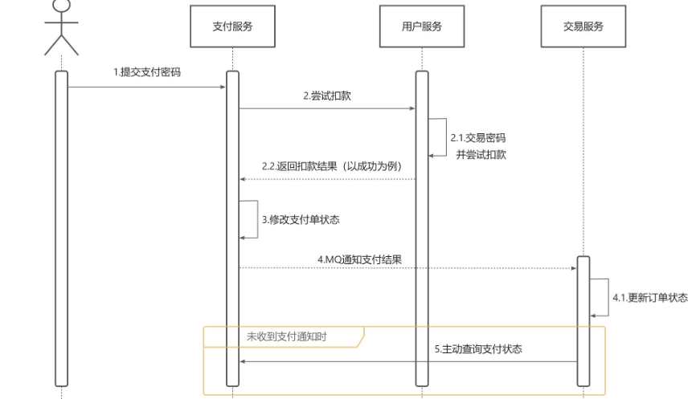

支付服务与交易服务之间的订单状态一致性是通过以下方式保证的：

1. **MQ消息通知：** 用户支付成功后，支付服务通过MQ消息通知交易服务更新订单状态。

2. **MQ消息可靠性保障：**
   - 生产者确认机制：确保消息成功发送到MQ。
   - 消费者确认机制：确保消息被交易服务成功消费。
   - 消费者失败重试：若消息处理失败，进行重试，保证消息最终被处理。

3. **定时任务兜底：** 交易服务设置定时任务定期查询订单支付状态，即使MQ通知失败，也能通过查询保证订单状态的最终一致性。

## 9 延迟消息

在电商支付业务中，为了防止未付款订单长时间占用库存，通常会设置支付超时时间，并在超时后取消订单释放库存。

要实现这种在一段时间后执行的任务（延迟任务），可以利用 RabbitMQ 的延迟消息功能。

RabbitMQ 中实现延迟消息的两种方案：

1. **死信交换机+TTL**：
   - 消息设置 TTL 过期后成为死信。
   - 死信被路由到死信交换机，再由死信交换机转发到指定队列。
   - 消费者监听队列，处理超时未支付的订单。

2. **延迟消息插件**：
   - 安装 RabbitMQ 延迟消息插件。
   - 创建支持延迟消息的交换机。
   - 消息发送时设置延迟时间。
   - 插件确保消息在指定时间后投递到队列。

两种方案都能实现延迟任务，但延迟消息插件更直接、配置更简单。

### 9.1 死信交换机

死信是指在 RabbitMQ 中无法被正常消费的消息。当消息满足以下条件之一时，就会变成死信：

1. 消费者使用 `basic.reject` 或 `basic.nack` 声明消费失败，并且消息的 `requeue` 参数设置为 false。
2. 消息过期，即在队列中停留的时间超过了设置的 TTL（Time-To-Live）。
3. 队列达到最大长度，无法再接收新消息。

死信交换机（Dead Letter Exchange，DLX）（对应属性 `dead-letter-exchange` ）是一个特殊的交换机，用于接收死信。当一个队列绑定了死信交换机，并且该队列中的消息变成死信时，死信就会被路由到死信交换机。

死信交换机的作用主要有以下几点：

1. **收集处理失败的消息：** 消费者拒绝消费或多次重试失败的消息会被发送到死信交换机，方便后续分析和处理。
2. **收集队列溢出的消息：** 当队列达到最大长度时，新消息无法进入队列，会被发送到死信交换机，防止消息丢失。
3. **收集过期消息：** 设置了 TTL 的消息在过期后会变成死信，被发送到死信交换机，避免过期消息占用队列资源。

通过使用死信交换机，可以有效地管理和处理无法正常消费的消息，提高消息系统的可靠性和稳定性。

> [!note] 死信交换机 & 死信队列 & `RoutingKey`
> - 向死信交换机发送消息的队列，可以通过设置 `x-dead-letter-routing-key` 属性来指定死信的 `RoutingKey`。
> - 如果没有设置 `x-dead-letter-routing-key` 属性，死信消息会沿用原始消息的 `RoutingKey`。
> - 死信交换机根据接收到的死信消息的 `RoutingKey`，将消息路由到与其绑定的、具有相同 `RoutingKey` 的死信队列。

> [!warning] RabbitMQ 消息过期提醒  
> - RabbitMQ 采用追溯方式处理过期消息，仅当消息位于队列头部时才会检查是否过期。  
> - 若队列消息堆积过多，过期消息可能无法及时处理，TTL 设置的时间可能不准确。

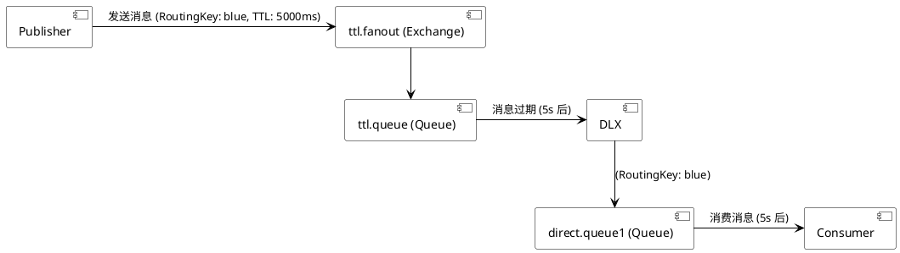

### 9.2 DelayExchange Plugin

> [!info]  
> [DelayExchange Plugin Usage](https://www.rabbitmq.com/blog/2015/04/16/scheduling-messages-with-rabbitmq#installing-the-plugin)  
> [DelayExchange Plugin Release](https://github.com/rabbitmq/rabbitmq-delayed-message-exchange/releases)

#### 9.2.1 下载

插件大版本号要和 RabbitMQ 大版本号一致

#### 9.2.2 安装

基于 Docker 安装需要先查看 RabbitMQ 的插件目录对应的数据卷中 `Mountpoint` ，上传插件到插件目录

```shell
docker volume inspect mq-plugins
```

```shell
docker exec -it mq rabbitmq-plugins enable rabbitmq_delayed_message_exchange
```

#### 9.2.3 声明延迟交换机

基于 `@Bean` 的方式：

```java
package org.example.consumer.config;  
  
import lombok.extern.slf4j.Slf4j;  
import org.springframework.amqp.core.*;  
import org.springframework.context.annotation.Bean;  
import org.springframework.context.annotation.Configuration;  
  
  
@Slf4j  
@Configuration  
public class DelayExchangeConfig {  
  
    @Bean  
    public DirectExchange delayExchange() {  
       return ExchangeBuilder  
             .directExchange("delay.direct") // 指定交换机类型和名称  
             .delayed() // 设置delay的属性为true  
             .durable(true) // 持久化  
             .build();  
    }  
  
    @Bean  
    public Queue delayedQueue() {  
       return new Queue("delay.queue");  
    }  
  
    @Bean  
    public Binding delayQueueBinding() {  
       return BindingBuilder.bind(delayedQueue()).to(delayExchange()).with("delay");  
    }  
}
```

基于注解方式：

```java
	/* // 测试延迟消息，已有配置类，可以删减注解
	@RabbitListener(bindings = @QueueBinding(
			value = @Queue(name = "delay.queue", durable = "true"),
			exchange = @Exchange(name = "delay.direct", delayed = "true"),
			key = "delay"
	))
	*/
	@RabbitListener(queues = "delay.queue")
	public void listenDelayMessage(String msg) {
		log.info("接收到delay.queue的延迟消息：{}", msg);
	}
```

#### 9.2.4 发送延迟消息

发送消息时，必须通过 x-delay 属性设定延迟时间：

```java
// 测试延迟消息  
@Test  
public void testPublisherDelayMessage() {  
    // 1.创建消息  
    String message = "hello, delayed message";  
    // 2.发送消息，利用消息后置处理器添加消息头  
    rabbitTemplate.convertAndSend("delay.direct", "delay", message, new MessagePostProcessor() {  
       @Override  
       public Message postProcessMessage(Message message) throws AmqpException {  
          // 添加延迟消息属性  
          message.getMessageProperties().setDelay(5000);  
          return message;  
       }  
    });  
}
```

> [!warning] 延迟消息插件使用提醒
>
> 延迟消息插件依赖本地数据库和定时器实现，设置过长的延迟时间可能导致：
>
> - 大量延迟消息堆积，增加 CPU 负担
> - 延迟时间出现误差
>
> 因此，**避免设置过长的延迟时间**。

### 9.3 订单状态同步问题

为避免订单超时支付时浪费MQ资源，可采用渐进式延迟消息策略：

1. **下单时发送多条延迟消息：** 设置不同延迟时间（如10秒、20秒..分钟），而非单条30分钟消息。
2. **检查订单状态：** 消费者收到消息后立即检查订单是否已支付。
3. **取消后续消息：** 若已支付，取消后续延迟消息。
4. **关闭未支付订单：** 若30分钟后仍未支付，关闭订单。

此策略能尽早发现已支付订单，减少MQ中滞留消息，优化资源利用。

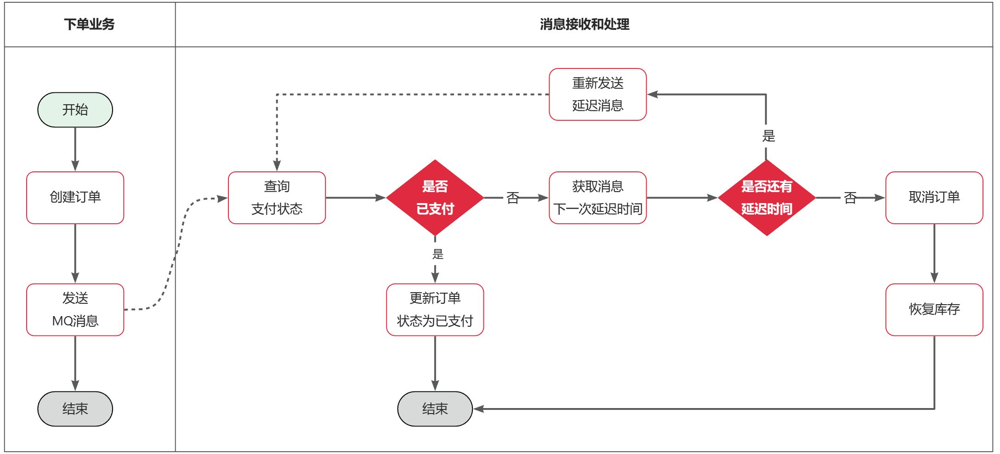

由于我们要多次发送延迟消息，因此需要先定义一个记录消息延迟时间的消息体，定义到通用模块下

```java
package org.example.common.domain;

import org.example.common.utils.CollUtils;
import lombok.Data;

import java.util.List;

@Data
public class MultiDelayMessage<T> {
    /**
     * 消息体
     */
    private T data;
    /**
     * 记录延迟时间的集合
     */
    private List<Long> delayMillis;

    public MultiDelayMessage(T data, List<Long> delayMillis) {
        this.data = data;
        this.delayMillis = delayMillis;
    }
    public static <T> MultiDelayMessage<T> of(T data, Long ... delayMillis){
        return new MultiDelayMessage<>(data, CollUtils.newArrayList(delayMillis));
    }

    /**
     * 获取并移除下一个延迟时间
     * @return 队列中的第一个延迟时间
     */
    public Long removeNextDelay(){
        return delayMillis.remove(0);
    }

    /**
     * 是否还有下一个延迟时间
     */
    public boolean hasNextDelay(){
        return !delayMillis.isEmpty();
    }
}

```

#### 9.3.1 定义常量

无论是消息发送还是接收都是在交易服务完成，因此我们在 `trade-service` 中定义一个常量类，用于记录交换机、队列、RoutingKey 等常量

```java
package org.example.trade.constants;

public interface MqConstants {
    String DELAY_EXCHANGE = "trade.delay.topic";
    String DELAY_ORDER_QUEUE = "trade.order.delay.queue";
    String DELAY_ORDER_ROUTING_KEY = "order.query";
}
```

#### 9.3.2 抽取共享 Mq 配置

> [!note] 配置优先级
> - **命令行参数:** 优先级最高，可通过 `--spring.config.name=myproject` 等形式设置
> - **Java 系统属性:** 通过 `-Dspring.config.name=myproject` 设置
> - **操作系统环境变量:** 通过设置环境变量 `SPRING_CONFIG_NAME=myproject` 来配置
> - **Nacos 配置中心:** Nacos 配置中心中的配置具有高优先级，会覆盖本地配置文件中的相同配置项
> - **打包在 jar 外部的配置文件:** 例如 `config/myproject.properties`
> - **打包在 jar 内部的 `bootstrap.yml` 配置文件:** 主要用于配置 Nacos 连接信息，以及一些应用启动所需的必要参数
> - **打包在 jar 内部的 `application.yml` 配置文件:** 用于配置应用的业务逻辑相关的参数  
我们将 mq 的配置抽取到 nacos 中，方便各个微服务共享配置

在 nacos 中定义一个名为 `shared-mq.xml` 的配置文件

> [!note] 配置文件中的占位符 `${:}` 解析
> 1. 先尝试在 nacos 中（其他配置项/环境变量/系统属性）获取
> 2. 没有则原样返回到 springboot
> 3. springboot 在环境变量/bootstrap 中获取
> 4. 没有则使用 `${A:B}` 的 `B` 默认值  
在没有 Nacos 等外部配置中心的情况下，Spring Boot 的配置优先级如下：

```yaml
spring:
  rabbitmq:
    host: ${mq.host:localhost} # 主机名
    port: ${mq.port:5672} # 端口
    virtual-host: ${mq.vhost:/test} # 虚拟主机
    username: ${mq.un:test} # 用户名
    password: ${mq.pw:test} # 密码
    listener:
      simple:
        prefetch: 1 # 每次只能获取一条消息，处理完成才能获取下一个消息
```

这里只添加一些基础配置，至于生产者确认，消费者确认配置则由微服务根据业务自己决定

在 `trade-service` 模块添加共享配置

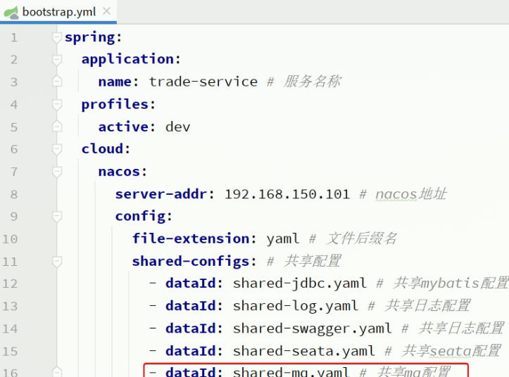

#### 9.3.3 改造下单业务

接下来，我们改造下单业务，在下单完成后，发送延迟消息，查询支付状态。

在 `trade-service` 模块的 `pom.xml` 中引入 amqp 的依赖：

```xml
  <!--amqp-->
  <dependency>
      <groupId>org.springframework.boot</groupId>
      <artifactId>spring-boot-starter-amqp</artifactId>
  </dependency>
```

修改 `trade-service` 模块的 `org.example.trade.service.impl.OrderServiceImpl` 类的 `createOrder` 方法，添加消息发送的代码：  

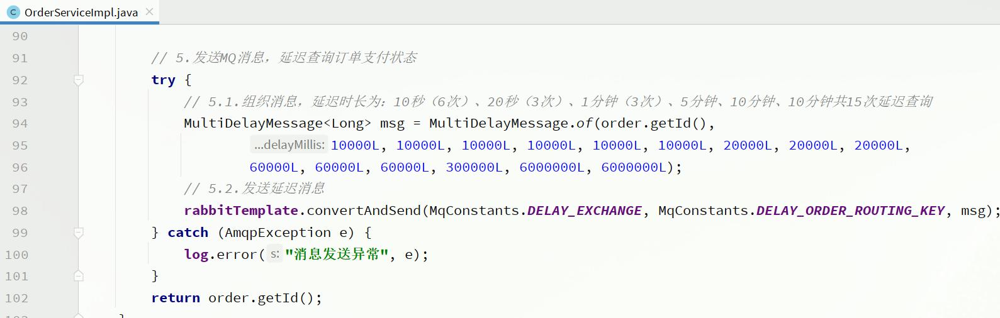

#### 9.3.4 编写查询支付状态接口

由于 MQ 消息处理时需要查询支付状态，因此我们要在 pay-service 模块定义一个这样的接口，并提供对应的 FeignClient

首先，在 api 模块定义三个类

- PayOrderDTO：支付单的数据传输实体
- PayClient：支付系统的 Feign 客户端
- PayClientFallback：支付系统的 fallback 逻辑

PayOrderDTO 代码如下：

```java
package org.example.api.dto;

import io.swagger.annotations.ApiModel;
import io.swagger.annotations.ApiModelProperty;
import lombok.Data;

import java.time.LocalDateTime;

/**
 * <p>
 * 支付订单
 * </p>
 */
@Data
@ApiModel(description = "支付单数据传输实体")
public class PayOrderDTO {
    @ApiModelProperty("id")
    private Long id;
    @ApiModelProperty("业务订单号")
    private Long bizOrderNo;
    @ApiModelProperty("支付单号")
    private Long payOrderNo;
    @ApiModelProperty("支付用户id")
    private Long bizUserId;
    @ApiModelProperty("支付渠道编码")
    private String payChannelCode;
    @ApiModelProperty("支付金额，单位分")
    private Integer amount;
    @ApiModelProperty("付类型，1：h5,2:小程序，3：公众号，4：扫码，5：余额支付")
    private Integer payType;
    @ApiModelProperty("付状态，0：待提交，1:待支付，2：支付超时或取消，3：支付成功")
    private Integer status;
    @ApiModelProperty("拓展字段，用于传递不同渠道单独处理的字段")
    private String expandJson;
    @ApiModelProperty("第三方返回业务码")
    private String resultCode;
    @ApiModelProperty("第三方返回提示信息")
    private String resultMsg;
    @ApiModelProperty("支付成功时间")
    private LocalDateTime paySuccessTime;
    @ApiModelProperty("支付超时时间")
    private LocalDateTime payOverTime;
    @ApiModelProperty("支付二维码链接")
    private String qrCodeUrl;
    @ApiModelProperty("创建时间")
    private LocalDateTime createTime;
    @ApiModelProperty("更新时间")
    private LocalDateTime updateTime;
}

```

PayClient 代码如下：

```java
package org.example.api.client;

import org.example.api.client.fallback.PayClientFallback;
import org.example.api.dto.PayOrderDTO;
import org.springframework.cloud.openfeign.FeignClient;
import org.springframework.web.bind.annotation.GetMapping;
import org.springframework.web.bind.annotation.PathVariable;

@FeignClient(value = "pay-service", fallbackFactory = PayClientFallback.class)
public interface PayClient {
    /**
     * 根据交易订单id查询支付单
     * @param id 业务订单id
     * @return 支付单信息
     */
    @GetMapping("/pay-orders/biz/{id}")
    PayOrderDTO queryPayOrderByBizOrderNo(@PathVariable("id") Long id);
}
```

PayClientFallback 代码如下：

```java
package org.example.api.client.fallback;

import org.example.api.client.PayClient;
import org.example.api.dto.PayOrderDTO;
import lombok.extern.slf4j.Slf4j;
import org.springframework.cloud.openfeign.FallbackFactory;

@Slf4j
public class PayClientFallback implements FallbackFactory<PayClient> {
    @Override
    public PayClient create(Throwable cause) {
        return new PayClient() {
            @Override
            public PayOrderDTO queryPayOrderByBizOrderNo(Long id) {
                return null;
            }
        };
    }
}
```

最后，在 pay-service 模块的 PayController 中实现该接口：

```java
@ApiOperation("根据id查询支付单")
@GetMapping("/biz/{id}")
public PayOrderDTO queryPayOrderByBizOrderNo(@PathVariable("id") Long id){
    PayOrder payOrder = payOrderService.lambdaQuery().eq(PayOrder::getBizOrderNo, id).one();
    return BeanUtils.copyBean(payOrder, PayOrderDTO.class);
}
```

#### 9.3.5 消息监听

接下来，我们在 trader-service 编写一个监听器，监听延迟消息，查询订单支付状态：

```java
package org.example.trade.listener;

import org.example.api.client.PayClient;
import org.example.api.dto.PayOrderDTO;
import org.example.common.domain.MultiDelayMessage;
import org.example.trade.constants.MqConstants;
import org.example.trade.domain.po.Order;
import org.example.trade.service.IOrderService;
import lombok.RequiredArgsConstructor;
import lombok.extern.slf4j.Slf4j;
import org.springframework.amqp.core.ExchangeTypes;
import org.springframework.amqp.rabbit.annotation.Exchange;
import org.springframework.amqp.rabbit.annotation.Queue;
import org.springframework.amqp.rabbit.annotation.QueueBinding;
import org.springframework.amqp.rabbit.annotation.RabbitListener;
import org.springframework.amqp.rabbit.core.RabbitTemplate;
import org.springframework.stereotype.Component;

@Slf4j
@Component
@RequiredArgsConstructor
public class OrderStatusListener {

    private final IOrderService orderService;

    private final PayClient payClient;

    private final RabbitTemplate rabbitTemplate;

    @RabbitListener(bindings = @QueueBinding(
            value = @Queue(name = MqConstants.DELAY_ORDER_QUEUE, durable = "true"),
            exchange = @Exchange(name = MqConstants.DELAY_EXCHANGE, type = ExchangeTypes.TOPIC),
            key = MqConstants.DELAY_ORDER_ROUTING_KEY
    ))
    public void listenOrderCheckDelayMessage(MultiDelayMessage<Long> msg) {
        // 1.获取消息中的订单id
        Long orderId = msg.getData();
        // 2.查询订单，判断状态：1是未支付，大于1则是已支付或已关闭
        Order order = orderService.getById(orderId);
        if (order == null || order.getStatus() > 1) {
            // 订单不存在或交易已经结束，放弃处理
            return;
        }
        // 3.可能是未支付，查询支付服务
        PayOrderDTO payOrder = payClient.queryPayOrderByBizOrderNo(orderId);
        if (payOrder != null && payOrder.getStatus() == 3) {
            // 支付成功，更新订单状态
            orderService.markOrderPaySuccess(orderId);
            return;
        }
        // 4.确定未支付，判断是否还有剩余延迟时间
        if (msg.hasNextDelay()) {
            // 4.1.有延迟时间，需要重发延迟消息，先获取延迟时间的int值
            int delayVal = msg.removeNextDelay().intValue();
            // 4.2.发送延迟消息
            rabbitTemplate.convertAndSend(MqConstants.DELAY_EXCHANGE, MqConstants.DELAY_ORDER_ROUTING_KEY, msg,
                    message -> {
                        message.getMessageProperties().setDelay(delayVal);
                        return message;
                    });
            return;
        }
        // 5.没有剩余延迟时间了，说明订单超时未支付，需要取消订单
        orderService.cancelOrder(orderId);
    }
}

```

这里要在 OrderServiceImpl 中实现 cancelOrder 方法

#### 9.3.6 取消订单

在处理超时未支付订单时，如果发现订单确实超时未支付，最终需要关闭该订单。  

关闭订单需要完成两件事情：

- 将订单状态修改为已关闭
- 恢复订单中已经扣除的库存

在 `IOrderService` 接口中定义 `cancelOrder` 方法：

```java
void cancelOrder(Long orderId);
```

并且在 `OrderServiceImpl` 中实现该方法。实现过程中要注意业务幂等性判断。
