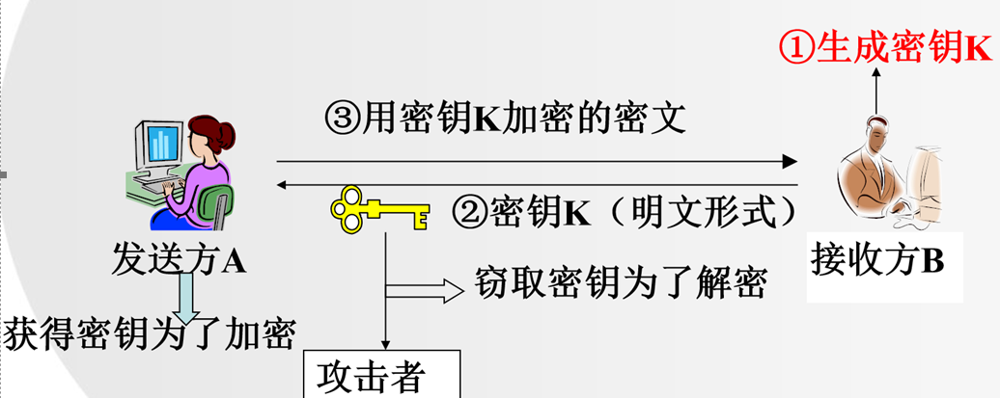
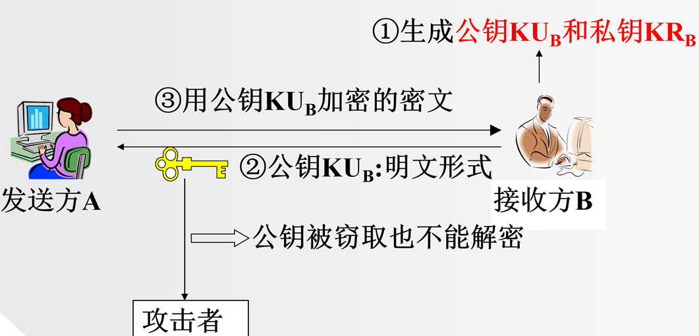
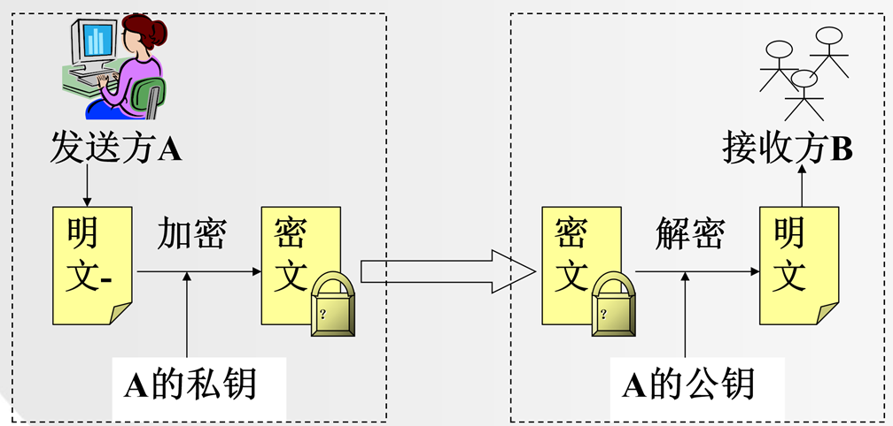
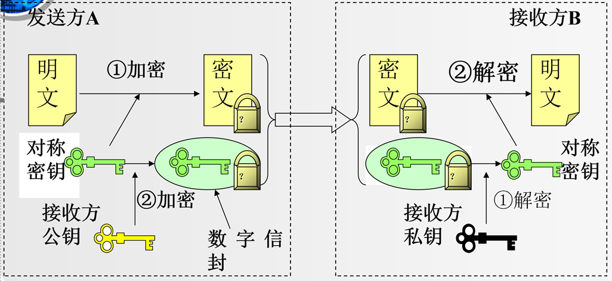
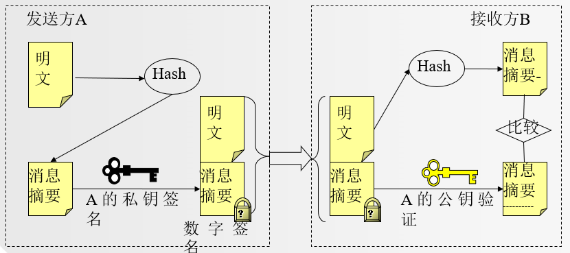
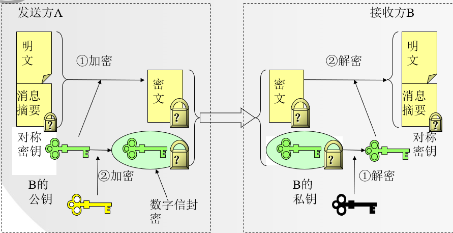

# 信息安全

## 1 密码学基本概念

- 密码系统
	- 由明文空间 `M`、密文空间 ` C `、密码方案和密钥空间 ` K ` 组成
	- 密码方案
		- 加密和解密在密钥 `k` 下运行
			- 加密 `E(m)`
				- encryption => 加密
				- message => 明文 `m`
			- 解密 `D(c)`
				- decryption => 解密
				- ciphertext => 密文 `c`

## 2 密钥分类

> [!tip] 1883年Kerchoffs第一次明确提出了编码的原则，即加密算法应建立在算法的公开不影响明文和密钥的安全的基础上。

- 密钥发展史
	- 古典密码
	- 近现代密码
- 保密性
	- 受限制的算法
	- 基于密钥的算法
- 加解密密钥是否相同
	- 对称密码体制
	- 公钥密码体制（非对称密码体制）
- 明文处理方式
	- 分组密码算法
	- 流密码算法
- 是否可逆的加密变换
	- 单向函数密码体制
	- 双向变换密码体制

### 2.1 古典密码

- 加密思想
	- 替代
	- 置换

- 单表替代密码
	- 移位密码
	- 仿射密码
	- 一般单表替代密码
	- 密钥短语密码
- 多表替代密码
	- 维吉尼亚密码
	- 希尔密码
- 单表/多表替代密码
	- 置换密码

#### 2.1.1 棋盘密码

##### 2.1.1.1 手动计算方法

棋盘密码使用一个5x5的字母方阵对字母进行编码。通常将字母I和J合并到同一个方格中。

例如，使用以下棋盘：

|     | 1   | 2   | 3   | 4   | 5   |
| --- | --- | --- | --- | --- | --- |
| 1   | A   | B   | C   | D   | E   |
| 2   | F   | G   | H   | I/J | K   |
| 3   | L   | M   | N   | O   | P   |
| 4   | Q   | R   | S   | T   | U   |
| 5   | V   | W   | X   | Y   | Z   |

每个字母由它的行和列表示。例如：

- A -> 11
- B -> 12
- C -> 13
- D -> 14
- E -> 15
- F -> 21
- G -> 22
- H -> 23
- I/J -> 24
- K -> 25

##### 2.1.1.2 示例

加密"HELLO"时：

- H -> 23
- E -> 15
- L -> 31
- L -> 31
- O -> 34

密文为"2315313134"。

#### 2.1.2 移位密码（凯撒密码）

##### 2.1.2.1 手动计算方法

凯撒密码通过将字母表中的每个字母移动固定的位数来加密文本。例如，向右移3位：  

- key  
	- 向右 => +  
	- 向左 => -

| A   | B   | C   | D   | E   | F   | G   | H   | I   | J   | K   | L   | M   | N   | O   | P   | Q   | R   | S   | T   | U   | V   | W   | X   | Y   | Z   |
| --- | --- | --- | --- | --- | --- | --- | --- | --- | --- | --- | --- | --- | --- | --- | --- | --- | --- | --- | --- | --- | --- | --- | --- | --- | --- |
| D   | E   | F   | G   | H   | I   | J   | K   | L   | M   | N   | O   | P   | Q   | R   | S   | T   | U   | V   | W   | X   | Y   | Z   | A   | B   | C   |

- 加密变换：E<sub>k</sub>(m)=m+k(mod 26)  m∈M, k∈K
- 解密变换：D<sub>k</sub>(c)=c-k(mod 26)  c∈C, k∈K

##### 2.1.2.2 示例

加密"HELLO"时，移位3位：

- H -> K
- E -> H
- L -> O
- L -> O
- O -> R

密文为"KHOOR"。

##### 2.1.2.3 代码示例

- 加密变换（需要处理两种情况）

```java
import java.util.Scanner;

public class CaesarEncrytion_weak {
	public static void main(String[] args) {
		Scanner input = new Scanner(System.in);
		System.out.println("输入plaintext");
		String plaintext = input.next();
		System.out.println("输入key");
		int key = input.nextInt();
		input.close();
		StringBuffer ciphertext = new StringBuffer();
		for (int i = 0; i < plaintext.length(); i++) {
			char c = plaintext.charAt(i);
			// 思路1：a-w(A-W)直接移位加上对应的移位数字
			if ((c >= 'a' && c <= 'z' - key) || (c >= 'A' && c <= 'Z' - key)) {
				c = (char) (c + key);
			} else if ((c >= 'z' - key && c <= 'z') || (c >= 'Z' - key && c <= 'Z')) {
				// 思路2：x-z(X-Z) chr-(26-key3) 比如：x x-(26-3)=120-23=97=a
				c = (char) (c - (26 - key));
			}
			ciphertext.append(c);
		}
		System.out.println("输出ciphertext");
		System.out.println(ciphertext);
	}
}
```

- 加密变换

```java
import java.util.Scanner;

public class CaesarEncrytion {
	public static void main(String[] args) {
		Scanner input = new Scanner(System.in);
		System.out.println("输入plaintext");
		String plaintext = input.next();
		System.out.println("输入key");
		int key = input.nextInt();
		input.close();
		StringBuffer ciphertext = new StringBuffer();
		for (int i = 0; i < plaintext.length(); i++) {
			char c = plaintext.charAt(i);
			if (c >= 'a' && c <= 'z') {
				// 验证: (a-97+3)%26+97=3%26+97=3+97=100=d
				c = (char) ((c - 'a' + key) % 26 + 'a');
				ciphertext.append(c);
			} else if (c >= 'A' && c <= 'Z') {
				// 验证: (a-97+3)%26+97=3%26+97=3+97=100=d
				c = (char) ((c - 'A' + key) % 26 + 'A');
				ciphertext.append(c);
			}
		}
		System.out.println("输出ciphertext");
		System.out.println(ciphertext);
	}
}
```

- 解密变换

```java
import java.util.Scanner;

public class CaesarDecryption {
	public static void main(String[] args) {
		Scanner input = new Scanner(System.in);
		System.out.println("输入ciphertext");
		String ciphertext = input.next();
		System.out.println("输入key");
		int key = input.nextInt();
		input.close();
		StringBuffer plaintext = new StringBuffer();
		for (int i = 0; i < ciphertext.length(); i++) {
			char c = ciphertext.charAt(i);
			if (c >= 'a' && c <= 'z') {
				// 验证：(d-97-3)%26+97=(100-97-3)%26+97=0%26+97=97=a
				c = (char) (Math.floorMod((c - 'a' - key), 26) + 'a');
				plaintext.append(c);
			} else if (c >= 'A' && c <= 'Z') {
				// 验证：(d-97-3)%26+97=(100-97-3)%26+97=0%26+97=97=a
				c = (char) (Math.floorMod((c - 'A' - key), 26) + 'A');
				plaintext.append(c);
			}
		}
		System.out.println("输出plaintext");
		System.out.println(plaintext);

	}
}
```

#### 2.1.3 维吉尼亚（Vigenere）密码

##### 2.1.3.1 手动计算方法

- 一种典型的多表替代密码，该密码体制有一个参数 `n`，表示采用 `n` 位长度的字符串（例如一个英文单词）作为密钥。
	- 设密钥 K = k<sub>1</sub>, k<sub>2</sub>, …, k<sub>n</sub>，明文 M = m<sub>1</sub>, m<sub>2</sub>, …, m<sub>n</sub>
		- E<sub>k</sub>(m<sub>1</sub>, m<sub>2</sub>, …, m<sub>n</sub>) = (m<sub>1</sub> + k<sub>1</sub> mod 26, m<sub>2</sub> + k<sub>2</sub> mod 26 , …, m<sub>n</sub> + k<sub>n</sub> mod 26 )
		- D<sub>k</sub>(c<sub>1</sub>, c<sub>2</sub>, …, c<sub>n</sub>) = (c<sub>1</sub> - k<sub>1</sub> mod 26, c<sub>2</sub> - k<sub>2</sub> mod 26 , …, c<sub>n</sub> - k<sub>n</sub> mod 26 )
		- 循环遍历密钥 `K`

| 字母  | a   | b   | c   | d   | e   | f   | g   | h   | i   | j   | k   | l   | m   | n   | o   | p   | q   | r   | s   | t   | u   | v   | w   | x   | y   | z   |
| --- | --- | --- | --- | --- | --- | --- | --- | --- | --- | --- | --- | --- | --- | --- | --- | --- | --- | --- | --- | --- | --- | --- | --- | --- | --- | --- |
|     | 0   | 1   | 2   | 3   | 4   | 5   | 6   | 7   | 8   | 9   | 10  | 11  | 12  | 13  | 14  | 15  | 16  | 17  | 18  | 19  | 20  | 21  | 22  | 23  | 24  | 25  |

##### 2.1.3.2 示例

- 明文：killthem
- 密钥：gun
- 密钥对应的数字：k = gun = (6, 20, 13)

| 明文       | k   | i   | l   | l   | t   | h   | e   | m   |
| -------- | --- | --- | --- | --- | --- | --- | --- | --- |
| 明文对应数字   | 10  | 8   | 11  | 11  | 19  | 7   | 4   | 12  |
| 密钥       | g   | u   | n   | g   | u   | n   | g   | u   |
| 密钥对应数字   | 6   | 20  | 13  | 6   | 20  | 13  | 6   | 20  |
| 相加取余     | 16  | 2   | 24  | 17  | 13  | 20  | 10  | 6   |
| 密文       | q   | c   | y   | r   | n   | u   | k   | g   |
| 密文对应数字   | 16  | 2   | 24  | 17  | 13  | 20  | 10  | 6   |
| 密钥       | g   | u   | n   | g   | u   | n   | g   | u   |
| 密钥对应数字   | 6   | 20  | 13  | 6   | 20  | 13  | 6   | 20  |
| 相减，负数+26 | 10  | 8   | 11  | 11  | 19  | 7   | 4   | 12  |
| 明文       | k   | i   | l   | l   | t   | h   | e   | m   |

#### 2.1.4 希尔（Hill）密码

##### 2.1.4.1 手动计算方法

- 希尔密码是一种基于线性代数的密码，它使用矩阵乘法对明文进行加密。密钥是一个方阵，明文被分成向量，与密钥矩阵相乘，然后取模得到密文。
- 数学定义：设m是一个正整数，令M=E=(Z<sub>26</sub>)<sup>m</sup>，密钥K<sub>m×m</sub>={定义在Z<sub>26</sub>上的m×m矩阵}，其中**K的行列式值必须和26互素**，否则不存在K的逆矩阵K<sup>-1</sup>。
- 对任意的密钥K<sub>m×m</sub>
	- E<sub>k</sub>(m) = K<sub>m×m</sub> · m (mod 26)
	- D<sub>k</sub>(c) = K<sup>-1</sup><sub>m×m</sub> · c (mod 26)  

| 字母  | a   | b   | c   | d   | e   | f   | g   | h   | i   | j   | k   | l   | m   | n   | o   | p   | q   | r   | s   | t   | u   | v   | w   | x   | y   | z   |
| --- | --- | --- | --- | --- | --- | --- | --- | --- | --- | --- | --- | --- | --- | --- | --- | --- | --- | --- | --- | --- | --- | --- | --- | --- | --- | --- |
|     | 0   | 1   | 2   | 3   | 4   | 5   | 6   | 7   | 8   | 9   | 10  | 11  | 12  | 13  | 14  | 15  | 16  | 17  | 18  | 19  | 20  | 21  | 22  | 23  | 24  | 25  |

##### 2.1.4.2 示例

- 加密矩阵 E

	```
	[1 1]
	[3 4]
	```

- 解密矩阵 D
	- D = E<sup>-1</sup>
		- 主对调，负变号
		- 二阶矩阵的值 != 0
			- 主对角线乘积 - 副对角线乘积 != 0
		- 验证
			- E = A x (A<sup>-1</sup> / |A|) = `[1 0][0 1]`

	```
	[4 -1]
	[-3 1]
	```

- 明文 m = "Hill"  
	- 明文矩阵 M

		```
		[7 11]
		[8 11]
		```

- 加密
	- EM (mod 26) = C => c = "pbwz"

		```
		EM = [1 1] [7 11]
			 [3 4] [8 11]
		   = [15 22]
		     [53 77] (mod 26)
		   = C
		   = [15 22]
			 [1  25]
		   = [p w]
		     [b z]
		   = c
		   = "pbwz"
		```

- 解密
	- DM (mod 26) = M => m = "hill"

		```
		DM = [4 -1] [15 22]
			 [-3 1] [1  25]
		   = [59   63]
		     [-44 -41] (mod 26)
		   = M
		   = [7 11]
			 [8 11]
		   = [h l]
		     [i l]
		   = m
		   = "hill"
		```

#### 2.1.5 仿射密码

##### 2.1.5.1 手动计算方法

- 加密变换
	- c = E<sub>k</sub>(m) = (k<sub>1</sub>m + k<sub>2</sub>) (mod 26)
- 解密变换
	- m = D<sub>k</sub>(c) = k<sub>1</sub><sup>-1</sup>(c - k<sub>2</sub>) (mod 26)
- 注意：**k1必须和26互素**，如果不互素，例如取k<sub>1</sub>=2，则明文m=m<sub>i</sub>和m=m<sub>i</sub>+13两个字符都将被映射成同一个密文字符。

##### 2.1.5.2 示例

| 字母  | a   | b   | c   | d   | e   | f   | g   | h   | i   | j   | k   | l   | m   | n   | o   | p   | q   | r   | s   | t   | u   | v   | w   | x   | y   | z   |
| --- | --- | --- | --- | --- | --- | --- | --- | --- | --- | --- | --- | --- | --- | --- | --- | --- | --- | --- | --- | --- | --- | --- | --- | --- | --- | --- |
|     | 0   | 1   | 2   | 3   | 4   | 5   | 6   | 7   | 8   | 9   | 10  | 11  | 12  | 13  | 14  | 15  | 16  | 17  | 18  | 19  | 20  | 21  | 22  | 23  | 24  | 25  |

1. 字母表 A - Z
2. K<sub>1</sub>是基本数，假设为3
3. K<sub>2</sub>是加密和解密的移位部分,假设是8
4. K3=K<sub>1</sub><sup>-1</sup>是K1的乘法逆元，如果上面是3，这里就是9
	- 乘法逆元：如果a和b的乘积模m等于1，那么我们就说b是a模m的乘法逆元
	- 数学公式：a x b mod m = 1
		- 已知a = 3, m = 26，求b
		- 3 x b mod 26 = 1 => b = 9
- 加密
	- 明文：ABC
	- 对应下标：012
	- 计算步骤
		- （K<sub>1</sub> x M + k<sub>2</sub>）% 26 = (3 x 0 + 8) % 26 = 8
		- （K<sub>1</sub> x M + k<sub>2</sub>）% 26 = (3 x 1 + 8) % 26 = 11
		- （K<sub>1</sub> x M + k<sub>2</sub>）% 26 = (3 x 2 + 8) % 26 = 14
	- 密文：ILO
- 解密
	- K<sub>3</sub> x (C - K<sub>2</sub>) % 26 = 9 x (8 - 8) % 26 = 0
	- K<sub>3</sub> x (C - K<sub>2</sub>) % 26 = 9 x (11 - 8) % 26 = 1
	- K<sub>3</sub> x (C - K<sub>2</sub>) % 26 = 9 x (14 - 8) % 26 = 2

##### 2.1.5.3 代码示例

```java
import java.util.Scanner;

public class AffineCipher {

	// 主函数
	public static void main(String[] args) {
		// 定义字母表
		char[] alphabet = { 'A', 'B', 'C', 'D', 'E', 'F', 'G', 'H', 'I', 'J', 'K',
				'L', 'M', 'N', 'O', 'P', 'Q', 'R', 'S', 'T', 'U', 'V', 'W',
				'X', 'Y', 'Z' };
		// 从用户那里获取明文
		Scanner input = new Scanner(System.in);
		System.out.println("Please enter the plaintext: ");
		String plainText = input.next();
		input.close();
		// 定义仿射密码的密钥
		int k1 = 3;
		int k2 = 8;
		int k3 = 9;
		// 创建 AffineCipher 对象
		AffineCipher ac = new AffineCipher();
		// 加密明文
		String cipherText = ac.encrypt(plainText, alphabet, k1, k2);
		// 解密密文
		ac.decrypt(cipherText, alphabet, k3, k2);
	}

	// 加密函数
	public String encrypt(String plainText, char[] alphabet, int k1, int k2) {
		// 将明文字符串转换为对应的数字数组
		int[] plainNum = new int[plainText.length()];
		for (int i = 0; i < plainText.length(); i++) {
			for (int j = 0; j < alphabet.length; j++) {
				if (alphabet[j] == plainText.charAt(i)) {
					plainNum[i] = j;
					break;
				}
			}

		}
		// 使用仿射密码公式进行加密
		char[] cipher = new char[plainText.length()];
		for (int i = 0; i < plainText.length(); i++) {
			int a = Math.floorMod((k1 * plainNum[i] + k2), 26);
			cipher[i] = alphabet[a];
		}
		System.out.println("Encryption: " + new String(cipher));
		return new String(cipher);
	}

	// 解密函数
	public String decrypt(String cipherText, char[] alphabet, int k3, int k2) {
		// 将密文转换为对应的数字数组
		int[] cipherNum = new int[cipherText.length()];
		for (int i = 0; i < cipherText.length(); i++) {
			for (int j = 0; j < alphabet.length; j++) {
				if (alphabet[j] == cipherText.charAt(i)) {
					cipherNum[i] = j;
				}
			}
		}
		// 使用仿射密码公式进行解密
		char[] plainText = new char[cipherText.length()];
		for (int i = 0; i < cipherText.length(); i++) {
			int a = Math.floorMod((k3 * (cipherNum[i] - k2)), 26);
			plainText[i] = alphabet[a];
		}
		System.out.println("Decryption: " + new String(plainText));
		return new String(plainText);
	}

}
```

#### 2.1.6 一般单表替代密码

##### 2.1.6.1 手动计算方法

单表替代密码使用一个固定的替代表将字母替换为其他字母。例如，使用以下替代表：

原始字母：A B C D E F G H I J K L M N O P Q R S T U V W X Y Z

替代字母：Q W E R T Y U I O P A S D F G H J K L Z X C V B N M

- 加密
	- 遍历明文，如果 = 源字符串 => 密文 += 密码对应字符
- 解密
	- 遍历密文，如果 = 密码 => 明文 += 源字符串对应字符

##### 2.1.6.2 示例

加密"HELLO"时：

- H -> I
- E -> T
- L -> S
- L -> S
- O -> G

密文为"ITSSG"。

##### 2.1.6.3 代码示例

```java
import java.util.ArrayList;
import java.util.Collections;
import java.util.HashSet;
import java.util.LinkedHashSet;
import java.util.List;
import java.util.Random;
import java.util.Scanner;
import java.util.Set;

public class SubstitutionAndKeyPhraseCipher {
	public static void main(String[] args) {
		char arr[] = { 'a', 'b', 'c', 'd', 'e', 'f', 'g', 'h', 'i', 'j', 'k', 'l', 'm', 'n', 'o', 'p', 'q', 'r', 's',
				't', 'u', 'v', 'w', 'x', 'y', 'z' };
		System.out.println("原始字符数组: " + new String(arr));
		Scanner input = new Scanner(System.in);
		System.out.println("请输入密钥短语");
		// char password[] = initializePassword();
		char password[] = initializePassword(input.next());
		System.out.println("请输入明文");
		String plaintext = input.next();
		input.close();
		String ciphertext = encrypt(plaintext, arr, password);
		System.out.println("加密后: " + ciphertext);
		plaintext = decrypt(ciphertext, arr, password);
		System.out.println("解密后: " + plaintext);
	}

	// 密钥短语密码：初始化密码短语
	public static char[] initializePassword(String key) {
		// 1. 从用户输入的字符串中去除重复字符
		Set<Character> chars = new LinkedHashSet<Character>();
		for (char c : key.toCharArray()) {
			chars.add(c);
		}
		// 2. 将字符放入数组作为前几个元素
		String password = "";
		for (char c : chars) {
			password += c;
		}
		// 3. 遍历 'a' 到 'z'，检查字符是否已经存在于数组中（contains），
		// 如果不存在，则继续追加
		for (char c = 'a'; c <= 'z'; c++) {
			if (!chars.contains(c)) {
				password += c;
			}
		}
		System.out.println("密码短语: " + password);
		return password.toCharArray();
	}

	// 单表替换密码：生成一个从 'a' 到 'z' 的随机字符数组
	public static char[] initializePassword() {
		List<Character> chars = new ArrayList<Character>();
		for (char c = 'a'; c <= 'z'; c++) {
			chars.add(c);
		}
		Collections.shuffle(chars, new Random());
		String password = "";
		for (char c : chars) {
			password += c;
		}
		System.out.println("密码短语: " + password);
		return password.toCharArray()

	}

	// 加密方法
	public static String encrypt(String plaintext, char arr[], char password[]) {
		String ciphertext = ""; // 初始化密文字符串
		for (int i = 0; i < plaintext.length(); i++) { // 遍历明文中的每个字符
			char c = plaintext.charAt(i); // 获取当前字符
			for (int j = 0; j < arr.length; j++) { // 遍历字符数组
				if (c == arr[j]) { // 如果当前字符等于字符数组中的某个字符
					ciphertext += password[j]; // 将对应的密钥字符添加到密文字符串
					break; // 跳出内层循环
				}
			}
		}
		return ciphertext; // 返回密文字符串
	}

	// 解密方法
	public static String decrypt(String ciphertext, char arr[], char password[]) {
		String plaintext = ""; // 初始化明文字符串
		for (int i = 0; i < ciphertext.length(); i++) { // 遍历密文中的每个字符
			char c = ciphertext.charAt(i); // 获取当前字符
			for (int j = 0; j < password.length; j++) { // 遍历密钥数组
				if (c == password[j]) { // 如果当前字符等于密钥数组中的某个字符
					plaintext += arr[j]; // 将对应的字符数组字符添加到明文字符串
					break; // 跳出内层循环
				}
			}
		}
		return plaintext; // 返回明文字符串
	}
}
```

#### 2.1.7 密钥短语密码

##### 2.1.7.1 手动计算方法

密钥短语密码使用一个关键词生成替代表。关键词中的字母在表前，剩下的字母按字母顺序排列。

关键词为"KEYWORD"：

1. 去重后：KEYWORD
2. 剩余字母：A B C F G H I J L M N P Q S T U V X Z

生成的替代表：  
K E Y W O R D A B C F G H I J L M N P Q S T U V X Z

- 加密
	- 遍历明文，如果 = 源字符串 => 密文 += 密码对应字符
- 解密
	- 遍历密文，如果 = 密码 => 明文 += 源字符串对应字符

##### 2.1.7.2 示例

加密"HELLO"时：

- H -> I
- E -> E
- L -> J
- L -> J
- O -> R

密文为"IEJJR"。

##### 2.1.7.3 代码示例

```java
import java.util.ArrayList;
import java.util.Collections;
import java.util.HashSet;
import java.util.LinkedHashSet;
import java.util.List;
import java.util.Random;
import java.util.Scanner;
import java.util.Set;

public class SubstitutionAndKeyPhraseCipher {
	public static void main(String[] args) {
		char arr[] = { 'a', 'b', 'c', 'd', 'e', 'f', 'g', 'h', 'i', 'j', 'k', 'l', 'm', 'n', 'o', 'p', 'q', 'r', 's',
				't', 'u', 'v', 'w', 'x', 'y', 'z' };
		System.out.println("原始字符数组: " + new String(arr));
		Scanner input = new Scanner(System.in);
		System.out.println("请输入密钥短语");
		// char password[] = initializePassword();
		char password[] = initializePassword(input.next());
		System.out.println("请输入明文");
		String plaintext = input.next();
		input.close();
		String ciphertext = encrypt(plaintext, arr, password);
		System.out.println("加密后: " + ciphertext);
		plaintext = decrypt(ciphertext, arr, password);
		System.out.println("解密后: " + plaintext);
	}

	// 密钥短语密码：初始化密码短语
	public static char[] initializePassword(String key) {
		// 1. 从用户输入的字符串中去除重复字符
		Set<Character> chars = new LinkedHashSet<Character>();
		for (char c : key.toCharArray()) {
			chars.add(c);
		}
		// 2. 将字符放入数组作为前几个元素
		String password = "";
		for (char c : chars) {
			password += c;
		}
		// 3. 遍历 'a' 到 'z'，检查字符是否已经存在于数组中（contains），
		// 如果不存在，则继续追加
		for (char c = 'a'; c <= 'z'; c++) {
			if (!chars.contains(c)) {
				password += c;
			}
		}
		System.out.println("密码短语: " + password);
		return password.toCharArray();
	}
	
	// 单表替换密码：生成一个从 'a' 到 'z' 的随机字符数组
	public static char[] initializePassword() {
		List<Character> chars = new ArrayList<Character>();
		for (char c = 'a'; c <= 'z'; c++) {
			chars.add(c);
		}
		Collections.shuffle(chars, new Random());
		String password = "";
		for (char c : chars) {
			password += c;
		}
		System.out.println("密码短语: " + password);
		return password.toCharArray()

	}

	// 加密方法
	public static String encrypt(String plaintext, char arr[], char password[]) {
		String ciphertext = ""; // 初始化密文字符串
		for (int i = 0; i < plaintext.length(); i++) { // 遍历明文中的每个字符
			char c = plaintext.charAt(i); // 获取当前字符
			for (int j = 0; j < arr.length; j++) { // 遍历字符数组
				if (c == arr[j]) { // 如果当前字符等于字符数组中的某个字符
					ciphertext += password[j]; // 将对应的密钥字符添加到密文字符串
					break; // 跳出内层循环
				}
			}
		}
		return ciphertext; // 返回密文字符串
	}

	// 解密方法
	public static String decrypt(String ciphertext, char arr[], char password[]) {
		String plaintext = ""; // 初始化明文字符串
		for (int i = 0; i < ciphertext.length(); i++) { // 遍历密文中的每个字符
			char c = ciphertext.charAt(i); // 获取当前字符
			for (int j = 0; j < password.length; j++) { // 遍历密钥数组
				if (c == password[j]) { // 如果当前字符等于密钥数组中的某个字符
					plaintext += arr[j]; // 将对应的字符数组字符添加到明文字符串
					break; // 跳出内层循环
				}
			}
		}
		return plaintext; // 返回明文字符串
	}
}
```

#### 2.1.8 置换密码

##### 2.1.8.1 手动计算方法

置换密码通过重新排列明文中的字符位置来加密信息。这里使用栅栏式置换。在栅栏式置换中，明文被写成栅栏形状的多个行，然后按行读取密文。  

假设密钥为N，那么明文将分为N行。字符按从上到下、再从下到上的锯齿形方式排列，直到结束。然后按行读取字符，组成密文。

### 2.2 密钥分配

- 解决密钥分配问题的关键
	- **线路上传输**的必须是**公钥**
	- 这个**公钥**必须是**接收方**的

> [!note] 如果A/B双方需要使用公钥加密算法互相发送加密信息，则需要两对公/私钥。即使用对方公钥进行加密。

> [!tip] 要防止接收方的公钥被假冒。

- **对称**密码系统需要的密钥数
	- *密钥数*与参与通信*人数的平方*成**正比**

	- $$ C_{n}^{2} = \frac{n \times (n - 1)}{2} $$

- **公钥**密码系统需要的密钥数
	- `n` 人 => `n` 对

| **特征**       | **对称密钥加密**       | **公钥加密**        |
| ------------ | ---------------- | --------------- |
| **加/解密所用密钥** | 相同               | 不同              |
| **加/解密速度**   | 快                | 慢               |
| **密文长度**     | 通常等于或小于明文长度      | 大于明文长度          |
| **密钥分配**     | 大问题              | 没问题             |
| **系统所需密钥总数** | 大约为参与者的平方个       | 等于参与者的个数        |
| **用法**       | 主要用于加/解密 (作会话密钥) | 主要用于加密会话密钥，数字签名 |

| **密钥产生方式** | **集中式**         | **分散式**         |
| ---------- | --------------- | --------------- |
| **代表**     | 密钥分配中心/CA证书分发中心 | 个人产生            |
| **生产者**    | 在中心统一进行         | 用户              |
| **用户数量**   | 用户数量受限制         | 用户数量不受限制        |
| **特点**     | 密钥质量高，方便备份      | 需第三方认证          |
| **安全性**    | 需安全的私钥传输通道      | 安全性高，只需将公钥传送给CA |

#### 2.2.1 对称密码体制

> [!note]
> - 加密密钥与解密密钥*相同*，这种体制只要知道加/解密算法，就可以反推解/加密算法。
>
> - 在1976年公钥密码算法提出以前的所有加密算法都是对称密码体制。
>
> - 对称密码体制
> 	- 分组密码
> 		- 分组密码将明文分成固定大小的块，然后使用相同的加密算法对每个块进行加密。
> 			- **AES**
> 				- 目前最流行的分组密码之一，用于各种应用，包括无线网络安全、文件加密和电子商务。
> 			- **DES**
> 				- 曾是美国政府的标准加密算法，但现在已被 AES 取代
> 			- **Blowfish**
> 				- 免费且不受专利限制。
> 	- 流密码
> 		- 流密码将明文和密钥流逐位异或（XOR）以生成密文。密钥流通常是使用伪随机数生成器（PRNG）从种子密钥生成的。
> 			- **RC4**
> 				- 现在已被认为不安全，不应再使用。
> 			- **A5/1**
> 				- 由 GSM（全球移动通信系统）使用。已被破解，不应再用于安全通信。
> 			- **ChaCha20**
> 				- ChaCha20 是一种快速且安全的流密码算法，适用于各种应用。  



#### 2.2.2 公钥密码体制

> [!tip] 加密使用公钥公开，无法实现保密性

> [!note]
> - 公钥密码体制
> - **DSA（Digital Signature Algorithm）**
> 	- 基于椭圆曲线密码学的公钥密码体制。它通常用于*数字签名*，因为与RSA相比，DSA的*签名生成和验证速度更快*。
> - **ECC（Elliptic Curve Cryptography）**
> 	- 基于椭圆曲线数学的公钥密码体制。它与RSA一样，也用于加密和解密数据。ECC的优势在于它可以在*较短的密钥长度*下提供*同等的安全性*。
> - **Paillier加密**
> 	- *同态加密*方案，密文可以进行某些计算操作，而无需解密。数据可以加密存储在云端，而无需担心数据泄露，适合于*云计算*等应用。
> - **RSA**
> 	- 密钥长度过长，性能开销大。
> 	- 存在潜在的量子攻击漏洞。
> 	- 公钥和私钥通常分别用 `KU` 和 `KR` 来指定。这是一种约定，并没有严格的技术规定。
> 	- `KU` 代表 **Key Usage**，即公钥的使用用途：
> 		- *加密*数据
> 		- *验证*数字签名
> 		- 进行*密钥交换*
> 	- `KR` 代表 **Key Role**，即私钥的角色：
> 		- *解密*由公钥加密的数据
> 		- *生成*数字签名
> 		- 进行*密钥交换*



## 3 数字签名

### 3.1 数字签名基本原理



### 3.2 数字签名作用

- **实现消息认证**
	- 证实某个消息确实是某用户发出的。
- **签名不可伪造**（特点）
	- 收方和第三方都不能伪造签名（unforgeable）
- **签名不可重用**（特点）
	- 签名是消息（文件）的一部分（绑定在一起），不能把签名移到其它消息（文件）上
- **实现不可抵赖性**
	- 消息的发送方不能否认他曾经发过该消息。
- **完整性保证**
	- 如果消息能够用公钥解密成功，还可确信消息在传输过程中没有被篡改过。

### 3.3 数字信封



> [!note] 不可逆加密体制  
> 单向散列函数 => 不可逆加密体制（单向密码体制）  
> 用于口令验证等场景（把登录密码加密后和已加密的数据库对应密码比较）

### 3.4 数字签名过程

#### 3.4.1 数字签名基本过程



#### 3.4.2 带有保密性的数字签名过程



## 4 散列函数 (HASH)

散列函数（Hash Functions）是将任意长度的输入数据（称为消息）转换为固定长度的输出数据（称为哈希值或摘要）的算法。这些函数在计算机科学中具有广泛的应用，例如数据校验、数字签名、哈希表和密码学。散列函数具有以下几个重要特性：

1. **确定性**：相同的输入总是生成相同的输出。
2. **快速计算**：对任意输入数据都能迅速计算出其哈希值。
3. **雪崩效应**：输入的微小变化会导致输出的哈希值有显著变化。
4. **抗碰撞性**：很难找到两个不同的输入具有相同的哈希值（称为碰撞）。
5. **单向性**：从哈希值几乎不可能反推出原始输入。

### 4.1 常用的散列函数

1. **MD5（Message-Digest Algorithm 5）**：
   - MD5 由 Ronald Rivest 于1991年设计。
   - 生成128位（16字节）的哈希值。
   - 尽管曾广泛使用，但由于存在严重的安全漏洞（如碰撞攻击），现在不推荐用于安全敏感的场合。

2. **SHA-1（Secure Hash Algorithm 1）**：
   - 由美国国家安全局（NSA）设计，并由NIST发布。
   - 生成160位（20字节）的哈希值。
   - 同样由于碰撞漏洞问题，已被认为不安全，目前逐渐被淘汰。

3. **SHA-2（Secure Hash Algorithm 2）**：
   - 包含多个变种，如SHA-224、SHA-256、SHA-384和SHA-512，分别生成224位、256位、384位和512位的哈希值。
   - 由NSA设计，是SHA-1的继任者，目前仍然广泛使用并被认为是安全的。

4. **SHA-3（Secure Hash Algorithm 3）**：
   - 基于Keccak算法，由Guido Bertoni、Joan Daemen、Michaël Peeters和Gilles Van Assche设计。
   - 包括SHA3-224、SHA3-256、SHA3-384和SHA3-512变种。
   - 是SHA-2的替代方案，提供了与SHA-2不同的算法结构，增强了多样性。

5. **RIPEMD-160**：
   - 由Hans Dobbertin、Antoon Bosselaers和Bart Preneel设计。
   - 生成160位的哈希值。
   - 虽然没有SHA-2和SHA-3那么广泛使用，但在某些应用中仍然可见。

6. **CRC32（Cyclic Redundancy Check 32）**：
   - 一种非加密散列函数，主要用于检测数据传输或存储中的错误。
   - 生成32位的校验值。

7. **Blake2**：
   - 由Jean-Philippe Aumasson等人设计。
   - 比SHA-2更快，并且在安全性和效能之间提供了很好的平衡。
   - 生成可变长度的哈希值（如Blake2b生成512位，Blake2s生成256位）。

8. **MurmurHash**：
   - 由Austin Appleby设计，适用于哈希表等应用的非加密散列函数。
   - 快速且具有很好的散列分布特性，常用于内存和性能要求较高的场景。

9. **CityHash**：
   - 由Google开发，设计用于高效地对大字符串进行哈希计算。
   - 提供不同的版本（如CityHash64、CityHash128），以适应不同的性能需求。

### 4.2 MAC

在密码学中，MAC（Message Authentication Code，消息认证码）是一种用于验证消息完整性和真实性的技术，它类似于散列函数，但使用了密钥来增加安全性。MAC 在消息传递过程中可以防止数据被篡改或伪造。

MAC 通常使用散列函数和密钥来生成一个固定长度的密文，这个密文被称为消息认证码。发送方使用密钥对消息进行加密，然后将消息和生成的 MAC 一起发送给接收方。接收方使用相同的密钥对接收到的消息进行解密，并计算消息的 MAC，然后比对计算得到的 MAC 和接收到的 MAC 来验证消息的完整性和真实性。

常见的 MAC 算法包括 HMAC（基于哈希的消息认证码）和 CMAC（密码消息认证码）等。MAC 在网络通信、数据传输和身份验证等领域被广泛应用，是保证通信安全性的重要技术之一。
